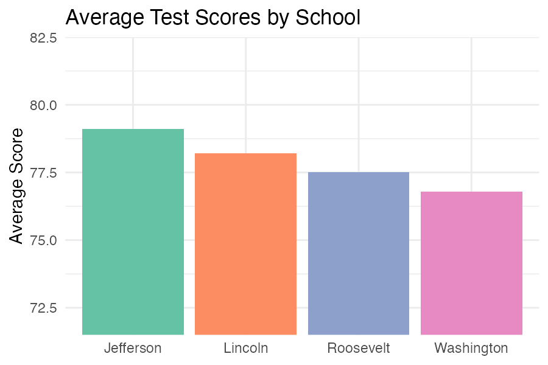
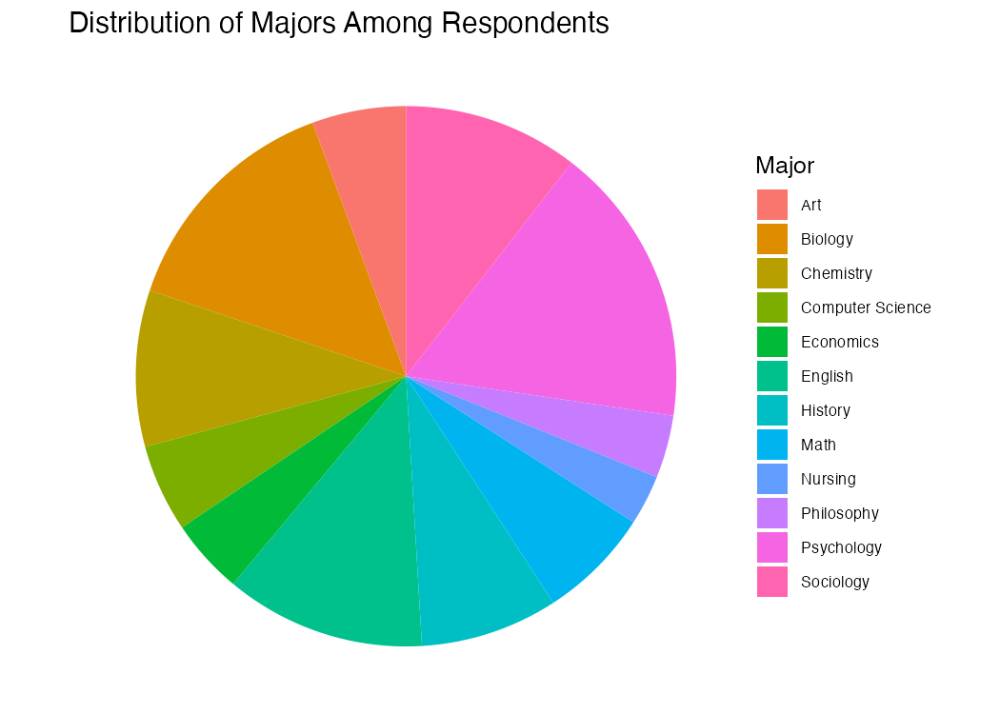
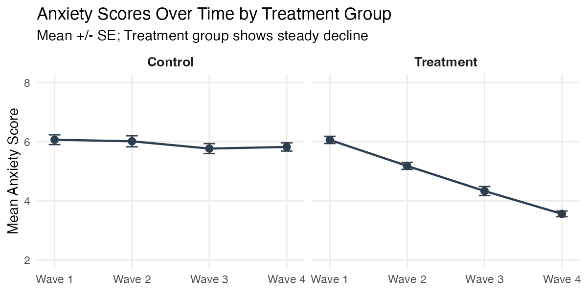
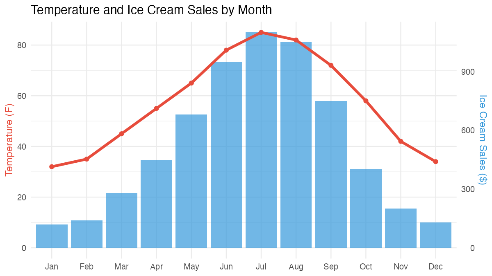
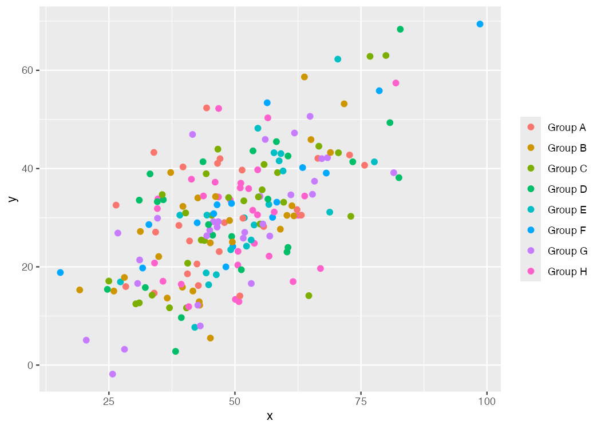

# Fun Challenge 9: Figure Courtroom

**Due:** Sunday, May 31 at 11:59 PM

You are the jury. Five figures are on trial. For each one, deliver a verdict:

- **Guilty** --- the figure is misleading. Identify the specific problem.
- **Boring** --- the figure is technically correct but ineffective. Explain why it fails to communicate.
- **Not guilty** --- the figure is effective. Explain what makes it work.

Write a **2--3 sentence verdict** for each figure. Be specific --- don't just say "it's bad." Say *why* and *how* it could be improved (for Guilty and Boring verdicts).

---

## Figure A

A bar chart comparing average test scores across four schools, with the y-axis starting at 72 instead of 0.

## Figure B

A pie chart showing the distribution of 12 different majors among survey respondents.

## Figure C

A small multiples (faceted) line chart showing trends in anxiety scores across 4 time points, separated by treatment group.

## Figure D

A dual-axis chart showing temperature on the left y-axis and ice cream sales on the right y-axis, plotted over 12 months.

## Figure E

A scatterplot with 8 groups mapped to color, no legend title, default gray background, and overlapping points with no transparency.

---

**Submit:** Your five verdicts (one per figure) in any document format. One submission per team.
