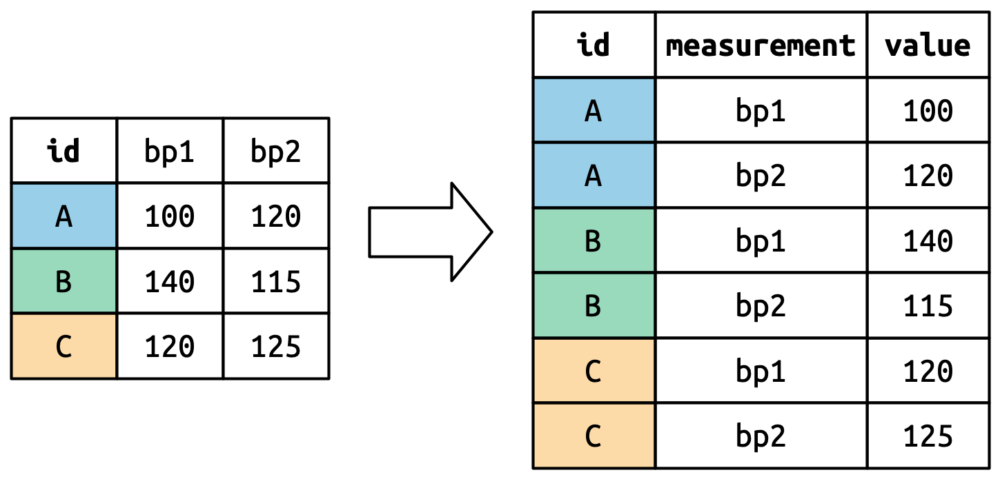
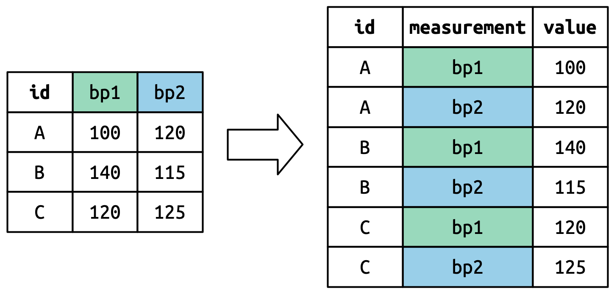

```{r}
#| include: false
library(tidyverse)
```

# What is tidy data? {background-color="#2c3e50"}

## Can you plot this?

```{r}
#| echo: false
tibble(
  participant = c("P1", "P2", "P3"),
  depression_pre = c(18, 22, 15),
  depression_post = c(12, 14, 11),
  anxiety_pre = c(24, 19, 28),
  anxiety_post = c(20, 15, 22)
) |>
  knitr::kable()
```

. . .

Not easily. The columns mix variables (depression vs anxiety) with time points (pre vs post). ggplot doesn't know what to put on each axis.

. . .

By the end of today, you'll be able to reshape this into a form that works — and understand *why* it needs reshaping.

::: {.notes}
Open by showing this table and asking the class: "If I wanted to make a line graph of pre vs. post scores, what goes on the x-axis? What goes on the y-axis?" Let them struggle for a moment — the confusion is the point. This motivates the entire session. Spend ~2 minutes here.
:::

## The tidyverse philosophy

> "Tidy datasets are all alike, but every messy dataset is messy in its own way."
> — Hadley Wickham

The tools we've learned (ggplot2, dplyr) expect data in a specific format: **tidy data**.

## What is a variable?

A **variable** is a characteristic that can take on different values — but all those values are measuring or describing the **same underlying thing**.

. . .

- **pre** and **post** aren't separate variables — they're values of `time`
- **Fall 2024**, **Spring 2025**, **Fall 2025** aren't separate variables — they're values of `semester`
- **bdi_1**, **bdi_2**, **bdi_3** aren't separate variables — they're values of `item`

. . .

When multiple columns are really values of the same underlying thing, they belong in **one column**.

::: {.notes}
This slide is critical — spend 2-3 minutes here. Students often struggle with tidy data rules because they don't have a working definition of "variable." Use the examples to show the pattern: the most common untidy problem is spreading one variable's values across multiple columns. A useful question to ask: "If I asked you 'what was the time point for this measurement?', where would you find that answer in the wide format?" (It's encoded in the column name — you can't filter or plot by it.) "What about in the long format?" (There's a column for it — easy.) That's the practical payoff of the definition.
:::

## The three rules of tidy data

1. Each **variable** is a column
2. Each **observation** is a row
3. Each **value** is a cell

. . .

Simple in theory, surprisingly complex in practice.

::: {.notes}
Spend ~3 minutes on the three rules. Have students say them aloud or repeat them back. The hardest part is rule 1 — students struggle with what counts as a "variable" vs. a "value." Emphasize that this isn't about right vs. wrong; it's about what structure makes analysis easiest. You'll come back to the "what is a variable?" question throughout the deck.
:::

## Tidy data visualized

```{r}
#| echo: false
tibble(
  participant = c("P1", "P2", "P3"),
  pre_test = c(45, 52, 48),
  post_test = c(62, 58, 71)
) |>
  knitr::kable(caption = "Is this tidy?")
```

. . .

**No!** Time (pre/post) is a variable, but it's spread across columns.

::: {.notes}
Pause before revealing the answer and poll the class: "Is this tidy?" Many students will say yes because it looks clean and organized. That's a great teaching moment — tidy doesn't mean "neat." Emphasize that pre_test and post_test are values of a time variable, not separate variables.
:::

## The tidy version

```{r}
#| echo: false
tibble(
  participant = rep(c("P1", "P2", "P3"), each = 2),
  time = rep(c("pre", "post"), 3),
  score = c(45, 62, 52, 58, 48, 71)
) |>
  knitr::kable(caption = "Now it's tidy!")
```

Now: participant, time, and score are all columns.

## Why does it matter?

**Tidy data works with tidyverse tools:**

```{r}
#| eval: false
# Easy to visualize
ggplot(data, aes(x = time, y = score, color = participant)) +
  geom_point()

# Easy to analyze
data |>
  group_by(time) |>
  summarize(mean = mean(score))
```

::: {.notes}
Connect this back to Sessions 2–4. Students already know ggplot and dplyr — point out that those tools assume tidy data. If their data isn't tidy, the code they've already learned won't work. This is the practical motivation: you're not reshaping for fun, you're reshaping so your tools work.
:::

## Wide vs. Long

:::: {.columns}
::: {.column width="50%"}
**Wide format**

- Variables spread across columns
- One row per subject
- Humans like to read this
:::

::: {.column width="50%"}
**Long format**

- Variables in a single column
- Multiple rows per subject
- R likes to work with this
:::
::::

Most real data needs reshaping.

::: {.notes}
Students often ask: "So wide is always wrong?" No — wide is fine for reading and some analyses. The key message is that most tidyverse tools expect long format, so you need to know how to get there. SPSS users especially will be used to wide format (one row per participant). Acknowledge that wide feels more natural to read, but long is what R needs.
:::

# Common untidy patterns {background-color="#2c3e50"}

## Pattern 1: Column headers are values

```{r}
wide_scores <- tibble(
  student = c("Alice", "Bob", "Carol"),
  fall_2024 = c(85, 78, 92),
  spring_2025 = c(88, 82, 95),
  fall_2025 = c(91, 85, 94)
)
wide_scores
```

The semester names are **values**, not variable names.

::: {.notes}
This is by far the most common untidy pattern in psychology data. Walk through this example slowly and ask: "What are the actual variables here?" (student, semester, score). The semester names are values of a semester variable, not variables in themselves. This is the pattern that pivot_longer() fixes. Spend ~2 minutes here; the next two patterns can be faster.
:::

## Pattern 2: Multiple variables in one column

```{r}
messy_data <- tibble(
  id = 1:3,
  age_sex = c("25_M", "32_F", "28_F")
)
messy_data
```

Age and sex are crammed into one column.

## Pattern 3: Variables in rows and columns

```{r}
weather <- tibble(
  id = c("MX001", "MX001", "MX002", "MX002"),
  year = c(2020, 2020, 2020, 2020),
  month = c(1, 2, 1, 2),
  element = c("tmax", "tmax", "tmin", "tmin"),
  value = c(85, 87, 32, 35)
)
weather
```

`element` contains variable names (tmax, tmin).

## Psychology-specific patterns

Surveys often look like:

```{r}
survey_wide <- tibble(
  participant = 1:3,
  bdi_1 = c(2, 1, 3),
  bdi_2 = c(1, 0, 2),
  bdi_3 = c(3, 2, 2),
  bdi_4 = c(2, 1, 1)
)
survey_wide
```

Each item is a column — wide format.

::: {.notes}
This is the example that will matter most for their assignments and thesis work. Point out that every Qualtrics export looks like this — one column per item. This dataset (survey_wide) will be reused in the pair coding exercise, so make sure students follow it. Transition: "Now let's learn the function that fixes this."
:::

# pivot_longer() {background-color="#2c3e50"}

## Recall: the data we're reshaping

```{r}
wide_scores
```

`fall_2024`, `spring_2025`, `fall_2025` are **values** of a `semester` variable — not separate variables. Let's fix that.

::: {.notes}
Brief recall slide. Students saw wide_scores a few slides ago in the "Pattern 1" example, but may have lost track. Point to the column names and repeat: "These three column names are really values of a semester variable. Our job is to move them into a single column." Then advance to the pivot_longer() demo.
:::

## The most common tidying operation

`pivot_longer()` takes wide data and makes it long:

```{r}
wide_scores |>
  pivot_longer(
    cols = fall_2024:fall_2025,  # Which columns to pivot
    names_to = "semester",        # New column for old column names
    values_to = "score"           # New column for values
  )
```

::: {.notes}
This is the most important slide in the deck. Walk through each argument slowly, pointing at the output as you explain. Key confusion point: students mix up names_to and values_to. Use this mnemonic — "names_to is where the old column NAMES go; values_to is where the old cell VALUES go." Run the code live so students see the output build. Spend ~3-4 minutes here.
:::

## Breaking it down

```{r}
#| eval: false
pivot_longer(
  cols = ...,        # Columns to reshape (use select helpers!)
  names_to = "...",  # Name for the new "names" column
  values_to = "..."  # Name for the new "values" column
)
```

::: {.notes}
Emphasize that names_to and values_to take quoted strings (these are new column names you are inventing). Students will forget the quotes — it's one of the most common errors. Also note that cols uses the same selection syntax they learned in select(), which helps it feel less foreign.
:::

## What's actually happening

::: {.r-stack}
::: {.fragment .fade-in-then-out .text-center}
{fig-alt="Diagram showing a wide data frame with 3 rows (participants A, B, C) and columns id, bp1, bp2 transforming into a long data frame with 6 rows, one per participant per measurement, with columns id, measurement, and value. Rows are color-coded by participant." width="85%"}

Each participant gets one row per pivoted column — **rows multiply**
:::

::: {.fragment .fade-in-then-out .text-center}
{fig-alt="Same transformation diagram, now highlighting the column headers bp1 and bp2 in the wide format, showing they become values in the measurement column of the long data frame." width="85%"}

The old column headers become **values** in the new `measurement` column
:::

::: {.fragment .text-center}
{fig-alt="Same transformation diagram, now highlighting individual cell values (100, 120, 140) in the wide format, showing they move into the value column of the long data frame." width="85%"}

The cell values move into the new `value` column
:::
:::

::: {.notes}
Click through the three images one at a time. Image 1: "Notice that 3 rows become 6 — each participant now has one row per measurement." Image 2: "The old column headers, bp1 and bp2, become values inside a new column called 'measurement'." Image 3: "The actual numbers in those cells move into a new column called 'value'." Then connect back: "In our example, the column headers are semester names, and the values are scores." Spend 2-3 minutes here — this visual model is more durable than the code explanation alone.
:::

## Selecting columns to pivot

Use any of the `select()` helpers:

```{r}
#| eval: false
# By name
pivot_longer(cols = c(fall_2024, spring_2025, fall_2025))

# By range
pivot_longer(cols = fall_2024:fall_2025)

# By pattern
pivot_longer(cols = starts_with("fall"))
pivot_longer(cols = contains("202"))

# Everything except
pivot_longer(cols = -student)
```

::: {.notes}
Highlight the "everything except" pattern (cols = -student) — in practice, this is what students will use most often. When you have 50 BDI items and one ID column, you don't want to list all 50 items. The negative selection is the practical shortcut.
:::

## Psychology example: Survey items

```{r}
survey_wide |>
  pivot_longer(
    cols = starts_with("bdi"),
    names_to = "item",
    values_to = "response"
  )
```

Now each response is its own row!

## Extracting information from names

What if column names contain useful info? We want to extract the time point (t1, t2, t3).

```{r}
# Scores at different time points
experiment_wide <- tibble(
  id = 1:3,
  score_t1 = c(100, 95, 110),
  score_t2 = c(105, 100, 115),
  score_t3 = c(108, 102, 120)
)
experiment_wide
```

## names_prefix argument

```{r}
experiment_wide |>
  pivot_longer(
    cols = starts_with("score"),
    names_to = "time",
    names_prefix = "score_",  # Remove this prefix from names
    values_to = "score"
  )
```

::: {.notes}
Without names_prefix, the time column would contain "score_t1", "score_t2", etc. — the full column name. That's messy. names_prefix strips the redundant part, leaving clean values like "t1", "t2", "t3". Students often forget this argument exists and try to fix the names afterward with mutate() + str_remove(). Mention that this is the cleaner approach.
:::

## names_pattern argument

For more complex parsing:

```{r}
# Column names like "bdi_1", "anxiety_1", etc.
multi_scale <- tibble(
  id = 1:2,
  bdi_1 = c(2, 1), bdi_2 = c(1, 2),
  anxiety_1 = c(3, 2), anxiety_2 = c(2, 3)
)
multi_scale
```

## names_pattern argument

For more complex parsing:
```{r}
multi_scale |>
  pivot_longer(
    cols = -id,
    names_to = c("scale", "item"),
    names_pattern = "(.+)_(.+)",  # Regex: anything_anything
    values_to = "response"
  )
```

::: {.notes}
This is an advanced feature — don't dwell on the regex syntax. The key idea is that column names sometimes contain TWO pieces of information (scale name AND item number), and names_pattern can split them into separate columns. Say: "You don't need to memorize the regex. Just know this exists for when your column names encode multiple things." Students will see this again in the real-world examples section.
:::

## Pivoting to calculate scale scores

```{r}
# Calculate BDI total from long format
survey_wide |>
  pivot_longer(
    cols = starts_with("bdi"),
    names_to = "item",
    values_to = "response"
  ) |>
  group_by(participant) |>
  summarize(bdi_total = sum(response))
```

::: {.notes}
This is the "aha" moment for many students — pivot_longer() isn't just reshaping for its own sake, it enables analyses they actually need. Walk through the pipeline: pivot to long, then group_by participant, then summarize. Point out that this is the exact workflow they'll use in the pair exercise in a moment. Transition: "Now you try it."
:::

# Pair coding break {background-color="#e67e22"}

## Your turn: 10 minutes

```{r}
#| code-fold: true
#| code-summary: "Click to see the data setup"
survey_wide <- tibble(
  participant = 1:3,
  bdi_1 = c(2, 1, 3),
  bdi_2 = c(1, 0, 2),
  bdi_3 = c(3, 2, 2),
  bdi_4 = c(2, 1, 1)
)
survey_wide
```

With a partner, figure out: Which participant has the highest mean BDI score?

::: {.callout-tip}
You'll need `pivot_longer()` followed by `group_by()` + `summarize()`. The column names start with `"bdi"` — that's a hint.
:::

::: {.notes}
Set a 10-minute timer. Circulate the room — the most common sticking point is getting the pivot_longer() arguments right. If pairs are stuck, ask: "Which columns do you want to pivot? What should the new columns be called?" After ~8 minutes, ask who has an answer. Participants 1 and 3 are tied for the highest mean (both 2.0); Participant 2 has the lowest (1.0).
:::

---

## Solution

```{r}
#| echo: true
#| eval: false
survey_wide |>
  pivot_longer(
    cols = starts_with("bdi"),
    names_to = "item",
    values_to = "response"
  ) |>
  group_by(participant) |>
  summarize(mean_bdi = mean(response))
```

# pivot_wider() {background-color="#2c3e50"}

## The opposite operation

Sometimes you need to go from long to wide:

```{r}
long_data <- tibble(
  participant = rep(1:3, each = 2),
  time = rep(c("pre", "post"), 3),
  score = c(45, 62, 52, 58, 48, 71)
)
long_data
```

::: {.notes}
Transition: "pivot_longer() is the workhorse, but sometimes you need to go the other direction." Spend less time on pivot_wider() — it's used less often and the logic mirrors what they just learned. About 5 minutes total for the pivot_wider() section is fine.
:::

## pivot_wider() syntax

```{r}
long_data |>
  pivot_wider(
    names_from = time,   # Column to get new column names from
    values_from = score  # Column to get values from
  )
```

::: {.notes}
Point out the naming symmetry: pivot_longer() uses names_TO and values_TO (you're creating new columns), while pivot_wider() uses names_FROM and values_FROM (you're pulling from existing columns). Students sometimes confuse the two — the to/from distinction helps.
:::

## When to use pivot_wider()

- Creating summary tables for reports
- Some analyses need wide format
- Merging data that was collected differently
- Human-readable output

## Multiple value columns

```{r}
# Long data with multiple measures
long_multi <- tibble(
  id = rep(1:2, each = 2),
  time = rep(c("pre", "post"), 2),
  score = c(45, 62, 52, 58),
  rt = c(500, 480, 520, 490)
)
long_multi
```

## Multiple value columns

```{r}
long_multi |>
  pivot_wider(
    names_from = time,
    values_from = c(score, rt)  # Multiple columns!
  )
```


# Real-world examples {background-color="#2c3e50"}

## Example 1: Repeated measures experiment

```{r}
# Data as you might receive it from SPSS
wide_rm <- tibble(
  subject = 1:4,
  cond_a_time1 = c(450, 520, 480, 510),
  cond_a_time2 = c(420, 490, 460, 480),
  cond_b_time1 = c(480, 540, 500, 530),
  cond_b_time2 = c(440, 510, 470, 500)
)
wide_rm
```

::: {.notes}
This is the flagship real-world example. Frame it as: "This is what reaction time data looks like when your advisor hands it to you from SPSS." The column names encode two variables (condition AND time), which is exactly the names_pattern use case from earlier. Walk through this example carefully — it reappears in the end-of-deck exercise.
:::

## Tidying repeated measures

```{r}
tidy_rm <- wide_rm |>
  pivot_longer(
    cols = -subject,
    names_to = c("condition", "time"),
    names_pattern = "cond_(.+)_time(.+)",
    values_to = "rt"
  )
tidy_rm
```

## Now we can analyze it!

```{r}
#| output-location: slide
#| fig-width: 10
#| fig-height: 5
#| fig-alt: "Line plot showing mean reaction times for conditions A and B at two time points. Both conditions decrease from time 1 to time 2, with condition B consistently slower than condition A."
tidy_rm |>
  group_by(condition, time) |>
  summarize(mean_rt = mean(rt), .groups = "drop") |>
  ggplot(aes(x = time, y = mean_rt, color = condition, group = condition)) +
  geom_point(size = 3) +
  geom_line() +
  labs(
    title = "Reaction Time by Condition and Time",
    x = "Time Point",
    y = "Mean Reaction Time (ms)"
  ) +
  theme_minimal(base_size = 14)
```

::: {.notes}
This is the payoff — show that once the data is tidy, the ggplot code uses skills students already know: group_by(), summarize(), then geom_point() and geom_line(). Refer back to the opening slide: "Remember when we couldn't figure out what to put on the axes? Now we can." The pipeline also reinforces that tidying and summarizing go hand in hand.
:::

## Example 2: Questionnaire with subscales

```{r}
# Raw questionnaire data
quest <- tibble(
  pid = 1:3,
  anx_1 = c(3, 2, 4), anx_2 = c(2, 3, 3), anx_3 = c(4, 2, 5),
  dep_1 = c(2, 1, 3), dep_2 = c(3, 2, 4), dep_3 = c(2, 1, 3)
)

quest
```

## Example 2: Questionnaire with subscales

```{r}
#| label: quest-sub
#| eval: false
# Tidy and calculate subscales
quest |>
  pivot_longer(
    cols = -pid,
    names_to = c("scale", "item"),
    names_pattern = "(.+)_(.+)",
    values_to = "response"
  ) |>
  group_by(pid, scale) |>
  summarize(subscale_mean = mean(response), .groups = "drop") |>
  pivot_wider(names_from = scale, values_from = subscale_mean)
```

## Example 2: Questionnaire with subscales

```{r}
#| ref.label: quest-sub
#| echo: false
```

::: {.notes}
This example shows a pivot_longer() followed by a pivot_wider() — a common real-world pattern. You pivot long to calculate subscale means, then pivot wide again to get one row per participant with separate columns for each subscale. Students often ask: "Why not just do the math in wide format?" You can, but it's brittle and doesn't generalize when you have many subscales or items.
:::

## Example 3: Multilevel/nested data

```{r}
# Students nested in classrooms
students <- tibble(
  classroom = rep(c("A", "B"), each = 3),
  student = 1:6,
  pretest = c(70, 75, 72, 68, 71, 69),
  posttest = c(80, 82, 78, 75, 79, 77)
)

students
```

## Example 3: Multilevel/nested data

```{r}
# Tidy for analysis
students |>
  pivot_longer(
    cols = c(pretest, posttest),
    names_to = "time",
    values_to = "score"
  )
```

# pivot_longer() trips everyone up the first time {background-color="#2c3e50"}

## Pitfall 1: Forgetting what's a variable

Ask yourself: What are my **variables**?

- Participant ID? ✓ Variable
- Time point? ✓ Variable (not separate columns!)
- Score? ✓ Variable
- Item number? Depends on your analysis

::: {.notes}
Students often ask about item number — is it a variable or not? The honest answer is "it depends on your analysis." If you want per-item analysis, keep it as a variable. If you just want a total score, it's a grouping artifact. Don't oversimplify this; acknowledging the ambiguity builds critical thinking about data structure.
:::

## Pitfall 2: Over-pivoting

Not everything needs to be long:

```{r}
#| eval: false
# Maybe this is fine as-is?
tibble(
  id = 1:3,
  age = c(25, 32, 28),
  gender = c("M", "F", "F"),
  score = c(85, 92, 88)
)
```

Age, gender, and score are **different variables** — keep them as columns.

## General tidying strategy

1. **Identify** the variables (what are you measuring?)
2. **Look** at your current structure (what's a row? column?)
3. **Determine** what operations you need
4. **Test** with a small subset first
5. **Verify** you haven't lost data

::: {.notes}
Emphasize step 5 — after pivoting, check that you have the expected number of rows. If you started with 3 participants and 4 items, pivot_longer() should give you 12 rows. If it doesn't, something went wrong. This is a quick sanity check that prevents silent errors. Transition: "Now try the full pipeline yourself."
:::

# Additional practice {background-color="#e67e22"}

## Try it yourself

```{r}
#| code-fold: true
#| code-summary: "Click to see the data setup"
wide_rm <- tibble(
  subject = 1:4,
  cond_a_time1 = c(450, 520, 480, 510),
  cond_a_time2 = c(420, 490, 460, 480),
  cond_b_time1 = c(480, 540, 500, 530),
  cond_b_time2 = c(440, 510, 470, 500)
)
wide_rm
```

On your own:

1. Pivot to long format, extracting **condition** and **time** from the column names
2. Calculate **mean RT by condition and time**
3. Bonus: make a line plot with condition on the x-axis and time mapped to color

```{r}
#| echo: false
#| eval: false
# Solution
wide_rm |>
  pivot_longer(
    cols = -subject,
    names_to = c("condition", "time"),
    names_pattern = "cond_(.+)_time(.+)",
    values_to = "rt"
  ) |>
  group_by(condition, time) |>
  summarize(mean_rt = mean(rt))
```

::: {.notes}
Individual work — give ~10 minutes if time allows. This uses names_pattern, which is the most challenging concept from today. If students are stuck, suggest starting simpler: just use cols = -subject, names_to = "cond_time", values_to = "rt" to at least get into long format, then worry about separating condition and time afterward. The bonus plot connects today's reshaping to the ggplot skills from Sessions 2-3.
:::

# Wrapping up {background-color="#2c3e50"}

## The tidyr toolkit

| Function | What it does |
|----------|--------------|
| `pivot_longer()` | Wide → Long |
| `pivot_wider()` | Long → Wide |

## The tidy data mantra

1. Each **variable** is a column
2. Each **observation** is a row
3. Each **value** is a cell

When in doubt, ask: "What would make this easiest to plot/analyze?"

## Before next class

📖 **Read:**

- [R4DS Ch 7: Data import](https://r4ds.hadley.nz/data-import)
- [R4DS Ch 20: Spreadsheets](https://r4ds.hadley.nz/spreadsheets)

✅ **Practice:**

- Reshape a dataset you've worked with
- Try tidying some messy example data
- Practice `pivot_longer()` — it's the most common

## Key takeaways

1. **Tidy data** has a specific structure that works with tidyverse
2. **pivot_longer()** is your most-used tidying function
3. **pivot_wider()** is useful for tables and some analyses
4. **Think about your variables** before reshaping
5. **Column names contain information** — extract it with `names_pattern`

## The one thing to remember

If your data isn't tidy, your analysis can't start. `pivot_longer()` is the bridge.

Next time: Data Import

::: {.notes}
End with the reminder about readings for next class (R4DS Ch 7 and Ch 20). If time permits, preview Session 6 briefly: "Next time we'll learn how to get your own data files into R — CSVs, Excel, SPSS files. You'll need that skill for every assignment going forward."
:::
