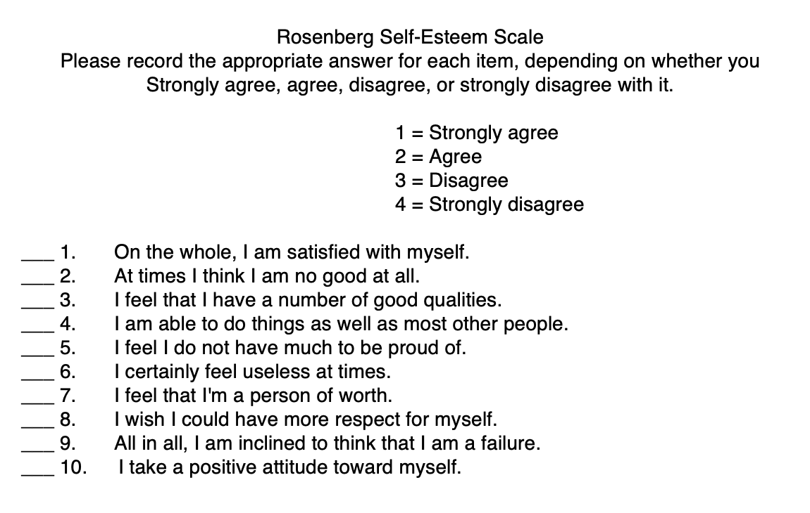

## Setup {visibility="hidden"}

```{r}
#| include: false
library(tidyverse)
```

# Why data types matter {background-color="#2c3e50"}

## A published error

A participant scores 4, 3, 2, 5, 1 on five items of the Rosenberg
Self-Esteem Scale. Item 3 is reverse-coded.

. . .

What's their total score?

. . .

If you said 15, you forgot to reverse-code — `2` should become
`(5 + 1) - 2 = 4`, making the real total **17**. This kind of mistake
happens in published papers, and it lives in how you handle data types.

::: {.notes}
Spend ~3 minutes here. Let students answer out loud before revealing the catch. This hooks them because it shows that "just adding numbers" is not always correct — data types and scoring decisions matter. Mention that reverse-coding errors are genuinely common in published work.
:::

## Everything in R is a type

In R, every value has a **type**:

-   `"hello"` is a **string** (character)
-   `42` is a **number** (double)
-   `TRUE` is a **logical** (boolean)
-   `"Female"` can be a **factor** (categorical)

Understanding types helps you choose the right functions, avoid cryptic
errors, and transform data correctly.

::: {.notes}
Move through this quickly — it is review from earlier sessions. The goal is just to name the four types so students have a mental map. Point out that today focuses on logicals and numbers; strings and factors come next session.
:::

## Today's focus

We'll dive into two fundamental types:

1.  **Logical vectors** — TRUE/FALSE values for filtering and
    conditional logic
2.  **Numbers** — integers and doubles for calculations and summaries

. . .

**Psychology application:** Computing scale scores, recoding responses,
handling missing data

# Logical vectors {background-color="#2c3e50"}

## What are logicals?

Logical vectors contain only `TRUE`, `FALSE`, or `NA`:

```{r}
x <- c(TRUE, FALSE, TRUE, NA, FALSE)
x
```

. . .

They're the result of comparisons:

```{r}
ages <- c(18, 22, 45, 17, 30)
ages >= 18  # Is each age 18 or older?
```

::: {.notes}
Emphasize that logicals are the result of asking a question about data, and that every filter() they have written so far has been producing logicals under the hood. The ages example connects to IRB eligibility, which students can relate to.
:::

## Comparison operators (review)

| Operator | Meaning                  |
|----------|--------------------------|
| `==`     | Equal to                 |
| `!=`     | Not equal to             |
| `<`      | Less than                |
| `>`      | Greater than             |
| `<=`     | Less than or equal to    |
| `>=`     | Greater than or equal to |
| `%in%`   | Is in a set              |

::: {.notes}
This is review — skim it quickly unless students look lost. Highlight that == is for comparison and = is for assignment; this is one of the most common syntax errors.
:::

## Logical operators

Combine comparisons with **Boolean operators**:

| Operator | Meaning | Example                                              |
|----------|---------|------------------------------------------------------|
| `&`      | AND     | `age >= 18 & age < 65`                               |
| `|`      | OR      | `diagnosis == "Depression" | diagnosis == "Anxiety"` |
| `!`      | NOT     | `!is.na(response)`                                   |

## AND vs OR

```{r}
age <- c(17, 22, 45, 70)
diagnosis <- c("Depression", "Anxiety", "Other", "Depression")

# AND: Both conditions must be TRUE
age >= 18 & age < 65
```

. . .

```{r}
# OR: At least one condition must be TRUE
diagnosis == "Depression" | diagnosis == "Anxiety"
```

::: {.notes}
Students often confuse AND and OR. Emphasize that AND narrows results (both must be true, so you get fewer rows) while OR broadens them (either can be true, so you get more rows). Ask students: "Which one gives you more rows back?" to check understanding.
:::

## Using logicals in filter()

```{r}
survey_data <- tibble(
  id = 1:5,
  age = c(17, 22, 45, 70, 30),
  consent = c(FALSE, TRUE, TRUE, TRUE, TRUE),
  depression = c(10, 25, 18, 12, 30)
)

# Keep only consenting adults with high depression
survey_data |>
  filter(consent & age >= 18 & depression >= 20)
```

## any() and all()

Check if **any** or **all** values are TRUE:

```{r}
responses <- c(TRUE, FALSE, FALSE, TRUE)

any(responses)   # Is at least one TRUE?
all(responses)   # Are all TRUE?
```

. . .

Useful for checking data quality:

```{r}
# Did anyone fail the attention check?
any(survey_data$consent == FALSE)
```

::: {.notes}
Emphasize the data-quality use case: you can use any() to check "did anyone fail this check?" and all() to check "did everyone complete this section?" These are handy sanity checks to run before analysis. Students may ask about the difference between any()/all() and sum() — clarify that any/all return a single TRUE/FALSE, while sum counts how many.
:::

## Counting with logicals

Remember: `TRUE = 1` and `FALSE = 0`

```{r}
# How many adults?
sum(survey_data$age >= 18)

# What proportion are adults?
mean(survey_data$age >= 18)
```

::: {.notes}
This is the key insight of the section: TRUE acts like 1 and FALSE acts like 0, so sum() counts TRUEs and mean() gives the proportion. Students find this surprising and useful. Pause to make sure it sinks in — it comes back when they compute scale scores later.
:::

# Conditional values {background-color="#2c3e50"}

## if_else(): Two-way decisions

`if_else()` creates new values based on a condition:

```{r}
survey_data |>
  mutate(
    age_group = if_else(age >= 18, "Adult", "Minor")
  )
```

**Syntax:** `if_else(condition, value_if_true, value_if_false)`

::: {.notes}
Walk through the syntax carefully: condition first, then what happens when TRUE, then what happens when FALSE. Students sometimes reverse the TRUE/FALSE order. Emphasize that if_else() is used inside mutate() to create new columns, not for control flow like an if statement in other languages.
:::

## Handling NA with if_else()

By default, `if_else()` keeps `NA` values:

```{r}
responses <- c(1, 2, NA, 4, 5)

if_else(responses >= 3, "High", "Low")
```

. . .

You can specify what to do with `NA`:

```{r}
if_else(responses >= 3, "High", "Low", missing = "No response")
```

::: {.notes}
The missing argument is new to most students. Point out the default behavior first (NA stays as NA), then show the override. Students often ask "why didn't NA become 'Low'?" — explain that NA means "we don't know the value," so the comparison NA >= 3 returns NA, not FALSE.
:::

## case_when(): Multiple conditions

For more than two outcomes, use `case_when()`:

```{r}
survey_data |>
  mutate(
    depression_category = case_when(
      depression < 14 ~ "Minimal",
      depression < 20 ~ "Mild",
      depression < 29 ~ "Moderate",
      depression >= 29 ~ "Severe"
    )
  )
```

::: {.notes}
Use the PHQ-9 cutoffs as a concrete example students will encounter in their careers. Walk through the logic slowly: "If depression is less than 14, label it Minimal. Otherwise, check if it is less than 20..." Emphasize the tilde (~) syntax — students often forget it or use = instead.
:::

## case_when() rules

-   Conditions are checked **in order**
-   The first `TRUE` condition wins
-   If no condition matches, you get `NA`

. . .

Always include a catch-all:

```{r}
#| eval: false
case_when(
  age < 18 ~ "Minor",
  age < 65 ~ "Adult",
  age >= 65 ~ "Senior",
  .default = NA  # Explicit about NAs
)
```

::: {.notes}
Spend a moment on .default — students frequently get unexpected NAs from case_when() because their conditions do not cover all values. Encourage them to always include .default as a safety net. Ask: "What happens if someone's age is NA? Which condition matches?" Answer: none, so they get NA from .default.
:::

## if_else() vs case_when() — when to use which

| Situation                           | Use           |
|-------------------------------------|---------------|
| Two outcomes (yes/no, pass/fail)    | `if_else()`   |
| Three or more categories            | `case_when()` |
| Recoding a Likert scale into groups | `case_when()` |
| Flagging a single condition         | `if_else()`   |

When in doubt, start with `if_else()`. Graduate to `case_when()` when
you need more categories.

## Psychology example: Reverse coding

{fig-align="center" width="600"}

::: {.notes}
Show the actual Rosenberg Self-Esteem Scale so students can see which items are reverse-coded. Ask if anyone has taken this measure in a psych class. This connects the abstract coding lesson to something tangible.
:::

## Psychology example: Reverse coding

Many scales have reverse-coded items:

::::: columns
::: {.column width="50%"}

```{r}
# Original responses (1-5 scale)
rosenberg <- tibble(
  id = 1:3,
  item1 = c(5, 4, 3),  # Regular item
  item2 = c(2, 3, 4)   # Reverse-coded item
)

# Reverse code item2
rosenberg = rosenberg |>
  mutate(
    item2_reversed = case_when(
      item2 == 1 ~ 5,
      item2 == 2 ~ 4,
      item2 == 3 ~ 3,
      item2 == 4 ~ 2,
      item2 == 5 ~ 1
    )
  )
```

:::

::: {.column width="50%"}

```{r}
rosenberg
```

:::
:::::


## Easier reverse coding

::: {.notes}
Transition: "case_when() works but is tedious for a 5-point scale — imagine a 7-point scale. There is a much simpler formula." This slide is the payoff.
:::

For scales, use arithmetic:

```{r}
rosenberg |>
  mutate(
    item2_reversed = 6 - item2  # For 1-5 scale: 6 - x
  )
```

. . .

General formula: `(max + min) - original_value`

-   1-5 scale: `6 - x` (because 1 + 5 = 6)
-   1-7 scale: `8 - x` (because 1 + 7 = 8)

::: {.notes}
Make sure students understand the general formula: (max + min) - value. Ask them to calculate the formula for a 0-4 scale (answer: 4 - x) to confirm understanding before moving to the exercise. Common mistake: students forget that the formula depends on the scale endpoints, not just the max.
:::

# Pair coding break {background-color="#e67e22"}

## Your turn: Recode responses

You have survey data with a 1-7 attention check item where the correct
answer is 4:

```{r}
attention_data <- tibble(
  participant_id = 1:6,
  attention_check = c(4, 3, 4, 7, NA, 4)
)
```

1.  Create a new column `passed` that is `TRUE` if they answered 4,
    `FALSE` otherwise
2.  Create a column `status` with three values: "Passed", "Failed", or
    "No response" (for NA)
3.  What proportion of participants passed?

**Time: 10 minutes**

::: {.notes}
Give 10 minutes. Circulate and watch for: (1) students using = instead of == in the comparison, (2) forgetting to handle NA in the case_when — the NA case must come first or use is.na(), (3) forgetting na.rm = TRUE in the mean() for question 3. After time is up, walk through the solution live. Emphasize that checking for NA first in case_when() is a good habit.
:::

```{r}
#| echo: false
#| eval: false
# SOLUTION
attention_data |>
  mutate(
    passed = attention_check == 4,
    status = case_when(
      is.na(attention_check) ~ "No response",
      attention_check == 4 ~ "Passed",
      .default = "Failed"
    )
  )

# Proportion who passed
attention_data |>
  summarize(prop_passed = mean(attention_check == 4, na.rm = TRUE))
```

# Numbers {background-color="#2c3e50"}

## Types of numbers

R distinguishes two numeric types:

-   **Integers:** whole numbers (1, 2, 3)
-   **Doubles:** numbers with decimals (1.5, 2.718, 3.14159)

. . .

Most of the time, R uses doubles automatically:

```{r}
typeof(42)
typeof(42L)  # The L forces it to be an integer
```

. . .

You rarely need to worry about this distinction!

::: {.notes}
Spend very little time here — the integer vs. double distinction almost never matters in practice for this course. The point is just awareness. If students ask, the main case where it matters is when checking types with is.integer() or when a function unexpectedly returns integer vs. double.
:::

## Rounding

```{r}
reaction_times <- c(245.678, 198.234, 312.891)

round(reaction_times)        # Round to nearest integer
round(reaction_times, 1)     # Round to 1 decimal place
floor(reaction_times)        # Round down
ceiling(reaction_times)      # Round up
```

## Summary functions (review)

Common calculations you've been using:

```{r}
scores <- c(12, 18, 25, 22, 30, 15, NA)

mean(scores, na.rm = TRUE)
median(scores, na.rm = TRUE)
sd(scores, na.rm = TRUE)
min(scores, na.rm = TRUE)
max(scores, na.rm = TRUE)
```

## The na.rm argument

Most summary functions need `na.rm = TRUE` to handle missing data:

```{r}
scores <- c(12, 18, NA, 22, 30)

mean(scores)              # Returns NA
mean(scores, na.rm = TRUE)  # Ignores NA
```

. . .

::: callout-warning
**Think carefully** — Should you exclude missing values? Or is
missingness meaningful?
:::

::: {.notes}
Pause on the callout. This is a conceptual point, not a coding one. Ask students: "If 20% of participants skipped the depression items, does that tell you something?" In psychology, missingness is often not random — people skip sensitive questions. This foreshadows the missing data session (Session 15).
:::


## Counting non-missing values

```{r}
scores <- c(12, 18, NA, 22, 30, NA)

sum(!is.na(scores))  # Count non-missing
```

. . .

Or in a summary:

```{r}
tibble(scores) |>
  summarize(
    n = sum(!is.na(scores)),
    mean_score = mean(scores, na.rm = TRUE)
  )
```

# Computing scale scores {background-color="#2c3e50"}

## Real psychology task: Scale scoring

You've collected survey data with multiple items per scale:

```{r}
scale_data <- tibble(
  id = 1:4,
  anxiety1 = c(3, 2, 4, NA),
  anxiety2 = c(4, 3, 5, 2),
  anxiety3 = c(3, 2, 4, 1),
  anxiety4 = c(4, 3, NA, 2)
)

scale_data
```

How do you compute a total or mean score?

::: {.notes}
This is the core practical section of the deck — plan ~15 minutes for the scale scoring walkthrough. Frame it as: "This is the single most common data task you will do as a psychology researcher." Walk through the data first so students see the NA values before you try to compute scores.
:::

## Option 1: Manual addition

```{r}
scale_data |>
  mutate(
    anxiety_total = anxiety1 + anxiety2 + anxiety3 + anxiety4
  )
```

. . .

**Problem:** If any item is `NA`, the whole sum is `NA`!

::: {.notes}
Let the output speak for itself — students will see participant 4 gets NA for the total even though they answered 3 out of 4 items. Ask: "Is that what we want?" This motivates the next slide.
:::

## Option 2: Sum with na.rm

We can't use `na.rm` directly in `mutate()` with `+`, but we can use
`sum()`:

```{r}
scale_data |>
  rowwise() |>  # Work row-by-row
  mutate(
    anxiety_total = sum(c(anxiety1, anxiety2, anxiety3, anxiety4),
                        na.rm = TRUE)
  ) |>
  ungroup()
```

::: {.notes}
rowwise() is new and important. Explain that by default, mutate works column-wise — sum() would add up the entire column. rowwise() tells R to work one row at a time. Warn students that they must ungroup() afterward, or subsequent operations will still be row-by-row and run slowly.
:::

## Computing mean scores

```{r}
scale_data |>
  rowwise() |>
  mutate(
    anxiety_mean = mean(c(anxiety1, anxiety2, anxiety3, anxiety4),
                        na.rm = TRUE)
  ) |>
  ungroup()
```

. . .

::: callout-tip
**Mean vs Total:** Use means when participants might have different
numbers of items answered.
:::

::: {.notes}
Highlight the practical difference: if participant A answered all 10 items and participant B answered only 5, their sums are not comparable, but their means are. This is why many published papers report mean scores rather than totals.
:::

## Cleaner approach: pivot then summarize

```{r}
#| output-location: slide
scale_data |>
  pivot_longer(
    cols = starts_with("anxiety"),
    names_to = "item",
    values_to = "response"
  ) |>
  group_by(id) |>
  summarize(
    anxiety_mean = mean(response, na.rm = TRUE),
    anxiety_total = sum(response, na.rm = TRUE),
    n_items = sum(!is.na(response))
  )
```

::: {.notes}
Present this as an alternative, not a replacement. The pivot approach is more elegant for large scales with many items, but rowwise() is more intuitive for beginners. Point out the bonus of n_items — it counts how many items each person actually answered, which feeds into the missingness rule on the next slide.
:::

## When to worry about missing items

Should you compute a scale score if someone only answered 1 out of 4
items?

. . .

Common rules:

-   **Require ≥ 50%** of items answered
-   **Require ≥ 75%** for critical scales
-   **Document your decision** clearly

::: {.notes}
This is a methods decision, not a coding decision. Emphasize that there is no single right answer — the rule depends on your scale and your field's conventions. The key is to choose a rule, apply it consistently, and report it in your methods section. Students often ask "what do most people do?" — 50% or 75% are both common.
:::

## Implementing a missingness rule

```{r}
scale_data |>
  rowwise() |>
  mutate(
    n_answered = sum(!is.na(c(anxiety1, anxiety2, anxiety3, anxiety4))),
    anxiety_mean = if_else(
      n_answered >= 3,  # At least 3 of 4 items
      mean(c(anxiety1, anxiety2, anxiety3, anxiety4), na.rm = TRUE),
      NA_real_  # NA if too many missing
    )
  ) |>
  ungroup()
```

## More complex scales: Subscales

Some measures have multiple subscales:

```{r}
dass_data <- tibble(
  id = 1:3,
  # Depression items
  dass_d1 = c(2, 3, 1), dass_d2 = c(3, 3, 2),
  # Anxiety items
  dass_a1 = c(1, 4, 2), dass_a2 = c(2, 4, 3),
  # Stress items
  dass_s1 = c(3, 2, 4), dass_s2 = c(4, 3, 4)
)
```

## Computing subscales

```{r}
#| output-location: slide
dass_data |>
  rowwise() |>
  mutate(
    depression = mean(c(dass_d1, dass_d2), na.rm = TRUE),
    anxiety = mean(c(dass_a1, dass_a2), na.rm = TRUE),
    stress = mean(c(dass_s1, dass_s2), na.rm = TRUE)
  ) |>
  ungroup() |>
  select(id, depression, anxiety, stress)
```

::: {.notes}
Mention that real scales like the DASS-21 have 7 items per subscale, not 2. The pattern is the same — just more columns in the c() call. If students ask about automating the column selection, you can preview c_across() but do not spend long on it; it appears in the end-of-deck solution.
:::

# End-of-deck exercise {background-color="#e67e22"}

## Practice: Score the PHQ-9

The PHQ-9 is a 9-item depression screener (0-3 scale):

```{r}
phq_data <- tibble(
  participant = 1:5,
  phq1 = c(2, 1, 3, 0, 2),
  phq2 = c(2, 0, 3, 1, NA),
  phq3 = c(1, 1, 2, 0, 2),
  phq4 = c(2, NA, 3, 0, 1),
  phq5 = c(1, 0, 3, 1, 2),
  phq6 = c(2, 1, 2, 0, 3),
  phq7 = c(1, 1, 3, 1, 2),
  phq8 = c(2, 0, 2, 0, 1),
  phq9 = c(1, 1, 3, 0, 2)
)
```

1.  Compute a **total score** (sum of all 9 items)
2.  Only compute the score if **at least 7 items** are answered
3.  Create a **severity category**: Minimal (0-4), Mild (5-9), Moderate
    (10-14), Moderately Severe (15-19), Severe (20-27)

::: {.notes}
Give ~10 minutes for this exercise. It ties together everything from today: rowwise(), sum with na.rm, if_else for the missingness threshold, and case_when for severity categories. Circulate and help with the case_when cutoffs — students often get the boundary conditions wrong (e.g., using < instead of <=). The solution uses c_across(), which is a nice shortcut to show when reviewing. If time is short, have students start and finish as homework.
:::

```{r}
#| echo: false
#| eval: false
# SOLUTION
phq_data |>
  rowwise() |>
  mutate(
    # Count items answered
    n_answered = sum(!is.na(c_across(phq1:phq9))),

    # Compute total only if enough items
    phq_total = if_else(
      n_answered >= 7,
      sum(c_across(phq1:phq9), na.rm = TRUE),
      NA_real_
    ),

    # Create severity category
    severity = case_when(
      is.na(phq_total) ~ "Missing",
      phq_total <= 4 ~ "Minimal",
      phq_total <= 9 ~ "Mild",
      phq_total <= 14 ~ "Moderate",
      phq_total <= 19 ~ "Moderately Severe",
      phq_total <= 27 ~ "Severe"
    )
  ) |>
  ungroup() |>
  select(participant, phq_total, n_answered, severity)
```

# Wrapping up {background-color="#2c3e50"}

## Key takeaways

1.  **Logical vectors** (TRUE/FALSE) are powerful for filtering and
    conditions
2.  **if_else()** for two-way decisions, **case_when()** for multiple
    outcomes
3.  **Reverse coding:** `(max + min) - value`
4.  **Scale scoring:**
    -   Use `rowwise()` + `sum()/mean()` with `na.rm = TRUE`
    -   Or pivot longer then group and summarize
    -   Decide how to handle missing items
5.  **Always document** your scoring decisions

## Before next class

📖 **Read:**

-   R4DS Ch 14: Strings (sections 14.1–14.3 only)
-   R4DS Ch 16: Factors

✅ **Do:**

-   Submit Assignment 5
-   Practice computing scale scores with your own data
-   Think about categorical variables in your final project

## The one thing to remember

Scoring a scale correctly is the most common data task in psychology —
and the easiest place to introduce errors.

See you Wednesday for strings and factors!

::: {.notes}
End on this takeaway. Remind students that Assignment 5 is due before next class, and the reading for next session is R4DS Ch 14 (just sections 14.1-14.3) and Ch 16 on factors. Preview that next class covers strings and factors — the other two data types from the opening slide.
:::

