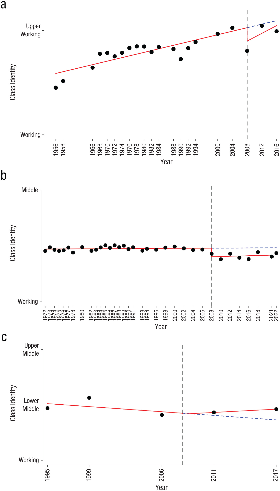
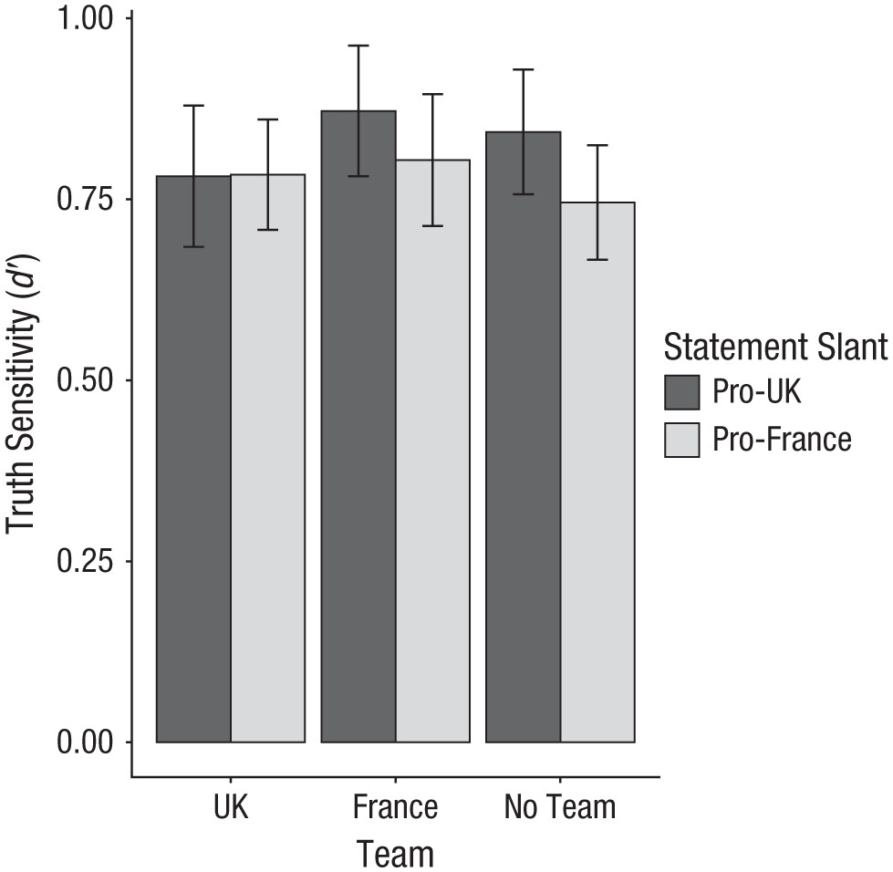

## Setup {visibility="hidden"}

```{r}
#| include: false
library(tidyverse)
```

# Why storytelling? {background-color="#2c3e50"}

::: {.notes}
Welcome back — reminder that Monday was Memorial Day, so it's been a full week since they were last in class (Session 15 on missing data). Today is Session 16: Storytelling with Data. Assignment 7 is due today and Assignment 8 (Storytelling Report) is assigned. Also distribute the APA figure formatting handout at the start of class. Structure: ~25 min lecture, ~15 min pair coding, ~20 min lecture part 2, ~10 min work time.
:::

## Data alone isn't enough

You've learned to:

- Import and clean data
- Transform and summarize
- Create visualizations
- Handle missing data

. . .

But **technical skills ≠ communication skills**

::: {.notes}
Spend ~2 minutes here. This slide should feel like a pivot — acknowledge everything they've learned so far, then reframe it. The incremental reveal makes the punchline land: all those skills are necessary but not sufficient. This sets up the "why" for the whole session.
:::

## The data storytelling triad

```{r}
#| echo: false
#| fig-width: 7
#| fig-height: 5
#| fig-align: center
#| fig-alt: "Venn diagram showing three overlapping circles for Data, Narrative, and Visuals. Where all three overlap, the word CHANGE appears, illustrating that effective data storytelling requires all three components."
library(ggforce)

triad <- tibble(
  x = c(-0.8, 0.8, 0),
  y = c(-0.3, -0.3, 0.8),
  label = c("Data", "Narrative", "Visuals")
)

ggplot(triad) +
  geom_circle(aes(x0 = x, y0 = y, r = 1.1, fill = label),
              alpha = 0.2, color = NA) +
  scale_fill_manual(values = c("Data" = "#3498db",
                                "Narrative" = "#e74c3c",
                                "Visuals" = "#2ecc71")) +
  annotate("text", x = -1.3, y = -0.8, label = "Data", fontface = "bold", size = 5) +
  annotate("text", x = 1.3, y = -0.8, label = "Narrative", fontface = "bold", size = 5) +
  annotate("text", x = 0, y = 1.5, label = "Visuals", fontface = "bold", size = 5) +
  annotate("text", x = 0, y = -0.6, label = "Explain", size = 4, color = "grey30") +
  annotate("text", x = -0.55, y = 0.4, label = "Enlighten", size = 4, color = "grey30") +
  annotate("text", x = 0.55, y = 0.4, label = "Engage", size = 4, color = "grey30") +
  annotate("text", x = 0, y = 0.05, label = "CHANGE", fontface = "bold", size = 5) +
  coord_equal() +
  guides(fill = "none") +
  theme_void()
```

::: {.aside}
Adapted from Brent Dykes
:::

::: {.notes}
This is the Dykes triad from the assigned reading. Spend ~3 minutes here. Walk through each pair: Data + Visuals = Enlighten (like a dashboard — informative but no narrative), Data + Narrative = Explain (like a report — words and numbers but no visuals), Visuals + Narrative = Engage (like an infographic — compelling but potentially empty). The center — all three together — is where you actually change minds or drive action. Students may ask whether "change" is too strong a word; emphasize that even in an academic paper, you're trying to change what the reader believes.
:::

## Why stories work

**Stories are memorable:**

- 63% of people remember stories
- Only 5% remember statistics

. . .

**Stories are persuasive:**

- Charity brochure study: Story about one child raised 2x more donations than statistics about millions

. . .

**Decisions are emotional:**

- We think we're rational
- But emotions drive decision-making
- Stories engage emotions

::: {.notes}
The charity brochure study is from Slovic (2007) — identifiable victim effect. Students sometimes push back on the "decisions are emotional" point; you can cite Damasio's somatic marker hypothesis if it comes up. The key message: if you want your research to matter outside academia, you need to communicate it in a way that connects with people, not just report p-values.
:::

## Your goal as a data scientist

**Don't just show data — tell a story that:**

1. Answers a specific question
2. Provides context
3. Highlights what matters
4. Leads to action or understanding

# The storytelling framework {background-color="#2c3e50"}

::: {.notes}
This section covers Knaflic's 5-step framework. Spend about 15 minutes total on Steps 1-5 before the pair coding break.
:::

## Step 1: Understand the context

Before making any visualization, ask:

- **Who is the audience?**
  - Researchers? General public? Clinicians? Grant reviewers?
- **What do they care about?**
  - Effect sizes? Practical implications? Cost savings?
- **What action do you want them to take?**
  - Fund your research? Change clinical practice? Read your paper?

::: {.notes}
Emphasize that this is the step most students skip. They jump straight to making a ggplot without asking who will see it or what they should do with it. Ask the class: "Who is the audience for your final project?" — it's their classmates and you, but push them to imagine a real-world audience. This connects directly to their final project planning.
:::

## Example: Different audiences, different stories

**Finding:** CBT reduces depression by 8 points on the BDI-II (d = 0.65)

. . .

**For researchers:**

- Effect size, confidence intervals, p-values
- Comparison to other interventions
- Limitations and future directions

. . .

**For clinicians:**

- Practical significance: "Patients move from moderate to mild depression"
- How to implement, training required
- Success rates, dropout rates

::: {.notes}
Walk through both audiences slowly. The key insight is that the same finding (CBT reduces depression by 8 BDI-II points, d = 0.65) produces fundamentally different presentations depending on who's listening. Researchers want to compare effect sizes; clinicians want to know what it means for their patients. Students sometimes ask "which is right?" — both are. Neither is complete on its own.
:::

## Step 2: Choose appropriate visuals

Match your plot type to your message:

| Goal | Good choice | Bad choice |
|------|-------------|------------|
| Show change over time | Line plot | Pie chart |
| Compare groups | Bar chart, boxplot | 3D pie chart |
| Show distribution | Histogram, density | Table |
| Show relationship | Scatterplot | Multiple pie charts |
| Show parts of whole | Stacked bar, treemap | 3D bar chart |

::: {.notes}
Move through the table quickly — this is review from earlier sessions on ggplot. The main new idea is "match your message," not just "match your data type." A scatterplot might be technically correct for a relationship, but if your message is about group differences, a boxplot tells that story better.
:::

## Step 3: Eliminate clutter

**Clutter** is anything that doesn't help your audience understand the message.

. . .

Common clutter:

- Unnecessary gridlines
- Heavy borders and backgrounds
- Too many colors
- Redundant labels
- Chart junk (3D effects, shadows, unnecessary decorations)

::: {.notes}
Clutter is Knaflic's term for anything that takes up visual space without adding information. Students often add clutter unintentionally because ggplot defaults include it (gridlines, legends for single-variable color mapping, etc.). The next two slides show a before/after — walk through the cluttered version first and ask students to identify what they'd remove.
:::

## Example: Cluttered figure

```{r}
#| output-location: slide
#| fig-alt: "Cluttered boxplot of depression scores by treatment condition with a blue background, heavy gridlines, rainbow fill colors, and a redundant legend — demonstrating common visual clutter to avoid."
therapy_data <- tibble(
  condition = rep(c("Control", "CBT", "Mindfulness"), each = 30),
  depression = c(rnorm(30, 18, 5), rnorm(30, 12, 5), rnorm(30, 14, 5))
)

ggplot(therapy_data, aes(x = condition, y = depression, fill = condition)) +
  geom_boxplot() +
  labs(title = "Depression Scores by Treatment Condition") +
  theme_gray() +
  theme(
    panel.background = element_rect(fill = "lightblue"),
    panel.grid.major = element_line(color = "darkgray", size = 1),
    panel.grid.minor = element_line(color = "gray", size = 0.5)
  )
```

::: {.notes}
Point out the specific clutter: the colored background, heavy gridlines, redundant legend (fill maps to the same variable as x-axis), and generic title. Ask students what they notice first — it's probably the blue background, not the data.
:::

## Example: Decluttered figure

```{r}
#| output-location: slide
#| fig-alt: "Clean boxplot of depression scores by condition using a single steelblue fill, no legend, a clean theme, and an assertion title stating CBT is most effective — demonstrating effective decluttering."
ggplot(therapy_data, aes(x = condition, y = depression)) +
  geom_boxplot(fill = "steelblue", alpha = 0.7) +
  labs(
    title = "CBT most effective at reducing depression",
    subtitle = "Post-treatment BDI-II scores (lower = better)",
    x = NULL,
    y = "Depression score"
  ) +
  theme_classic()
```

::: {.notes}
Walk through the changes: theme_classic() removes the background, single fill color removes the legend, the title now makes a claim instead of describing the axes, and the subtitle provides context (what the score means). Emphasize the title shift — from "Depression scores by condition" (label) to "CBT most effective at reducing depression" (assertion). This is a recurring theme in the deck.
:::

## Build your own theme

`theme_classic()` is a great starting point. You can customize it into a reusable function:

```{r}
theme_story <- function(base_size = 14) {
  theme_classic(base_size = base_size) %+replace%
    theme(
      text = element_text(color = "grey40"),
      axis.line = element_line(color = "grey60"),
      axis.ticks = element_line(color = "grey60"),
      axis.text = element_text(color = "grey40"),
      plot.title = element_text(color = "grey30", face = "bold", hjust = 0, size = rel(1.3)),
      plot.subtitle = element_text(color = "grey40", hjust = 0),
      plot.title.position = "plot",
      plot.caption.position = "plot"
    )
}
```

. . .

Now you can use `theme_story()` anywhere — and every figure looks consistent.

::: {.notes}
This is aspirational for most students at this point — don't expect them to write custom theme functions for their final project. The point is to show that theme customization is reusable, not one-off. If students ask about `%+replace%`, explain it's a ggplot2-specific operator that fully replaces theme elements instead of merging them. They don't need to memorize it; they just need to know the pattern exists.
:::

## Side by side: `theme_classic()` vs `theme_story()`

```{r}
#| echo: false
#| fig-width: 10
#| fig-height: 4
#| fig-align: center
#| fig-alt: "Side-by-side bar charts comparing theme_classic and theme_story. The theme_story version has softer grey text, grey axes, and a plot-aligned title, showing how small theme tweaks improve readability."
library(patchwork)

p_data <- therapy_data |>
  group_by(condition) |>
  summarize(mean_depression = mean(depression))

p_classic <- ggplot(p_data, aes(x = condition, y = mean_depression)) +
  geom_col(fill = "steelblue") +
  labs(title = "theme_classic()", x = NULL, y = "Depression score") +
  theme_classic()

p_story <- ggplot(p_data, aes(x = condition, y = mean_depression)) +
  geom_col(fill = "steelblue") +
  labs(title = "theme_story()", x = NULL, y = "Depression score") +
  theme_story()

p_classic + p_story
```

Grey text, grey axes, title aligned to the full plot — small changes, big improvement.

## Gestalt principles of design

Your brain groups things automatically based on:

1. **Proximity** — things close together are related
2. **Similarity** — things that look similar are related
3. **Enclosure** — things inside a boundary are related
4. **Connection** — things connected by lines are related

. . .

Use these principles intentionally!

::: {.notes}
These are Gestalt principles from perceptual psychology — connect this to their psych background. They've probably seen these in an intro or sensation/perception course. The point here is that these principles aren't just academic — they have practical design implications. Proximity: group related elements. Similarity: use consistent color/shape for related categories. Enclosure: use facets or annotated rectangles. Connection: use lines to show trajectories.
:::

## Step 4: Focus attention

**Preattentive attributes** are processed by the brain in < 500ms:

- **Position** (most powerful)
- **Size**
- **Color** (especially contrast)
- **Shape**

. . .

Use these to **direct attention to what matters**

::: {.notes}
Preattentive processing is another psych concept they may recognize. The key insight: you can use these attributes to create a visual hierarchy without the viewer even thinking about it. Color contrast is the one they'll use most in practice. The next two slides show the same data with and without strategic use of color to focus attention.
:::

## Example: Without focus

```{r}
#| output-location: slide
#| fig-alt: "Bar chart of mean depression scores by condition with all bars in uniform gray. Without color contrast, no single condition stands out and the viewer must work to identify the key finding."
therapy_summary <- therapy_data |>
  group_by(condition) |>
  summarize(mean_depression = mean(depression))

ggplot(therapy_summary, aes(x = condition, y = mean_depression)) +
  geom_col(fill = "gray50") +
  labs(
    title = "Mean depression by condition",
    x = "Condition",
    y = "Mean depression score"
  ) +
  theme_story()
```

::: {.notes}
All bars are the same gray — the viewer has to read every bar and compare. There's no visual cue about which bar matters. Ask students: "What's the takeaway from this figure?" They'll have to work to answer.
:::

## Example: With focus

```{r}
#| output-location: slide
#| fig-alt: "Bar chart of mean depression scores where the CBT bar is highlighted in steelblue while other bars are gray, immediately drawing attention to CBT as the most effective condition."
therapy_summary <- therapy_summary |>
  mutate(highlight = if_else(condition == "CBT", "Highlight", "Normal"))

ggplot(therapy_summary, aes(x = condition, y = mean_depression, fill = highlight)) +
  geom_col() +
  scale_fill_manual(values = c("Highlight" = "steelblue", "Normal" = "gray70")) +
  labs(
    title = "CBT reduces depression more than other conditions",
    subtitle = "Mean post-treatment BDI-II scores",
    x = NULL,
    y = "Depression score"
  ) +
  theme_story() +
  theme(legend.position = "none")
```

::: {.notes}
Now CBT pops immediately — the blue bar stands out from the gray. Walk through the code: the `if_else()` + `scale_fill_manual()` pattern is the key technique. Students will use this in the pair coding exercise and in their final projects. Also note the title changed from a label ("Mean depression by condition") to an assertion ("CBT reduces depression more than other conditions"). This is a technique they should apply to every figure.
:::

## Step 5: Think like a designer

**Visual hierarchy** guides the eye:

1. **Title** — what should they remember?
2. **Main visual** — the data
3. **Supporting elements** — axes, labels, legend
4. **Context** — subtitle, caption, notes

. . .

**Size matters:**

- Important = bigger
- Secondary = smaller

::: {.notes}
Move through this quickly — it reinforces what was just shown. The visual hierarchy concept maps to ggplot elements: title = labs(title), main visual = geom layer, supporting = theme elements, context = labs(subtitle, caption). Students often make everything the same size and weight; encourage them to think about what the viewer's eye should land on first.
:::

## Effective titles

**Bad title:** "Depression scores by condition"

. . .

**Better title:** "CBT most effective at reducing depression"

. . .

**Even better (with context):**

- Title: "CBT reduces depression by 8 points"
- Subtitle: "Compared to control (2 points) and mindfulness (4 points)"

::: {.notes}
This is one of the most actionable slides in the deck. Students often ask "but my advisor said the title should be descriptive, not a claim." The answer: it depends on the context. For a final project presentation or a talk, assertion titles are better. For a journal figure, a descriptive title is conventional. Both have their place, but assertion titles force you to know what the figure is actually showing.
:::

## Color best practices

1. **Use color purposefully** — to highlight, not decorate
2. **Be colorblind-friendly** — use `viridis` or `ColorBrewer`
3. **Limit your palette** — 3-5 colors maximum
4. **Consider meaning** — red = danger/bad, green = good, blue = neutral

## Color example: Before

```{r}
#| output-location: slide
#| fig-alt: "Bar chart of participant counts by age group using four different fill colors, one per bar. The rainbow coloring adds no information since the x-axis already identifies each group."
demographics <- tibble(
  age_group = c("18-25", "26-35", "36-45", "46+"),
  count = c(45, 67, 52, 23)
)

ggplot(demographics, aes(x = age_group, y = count, fill = age_group)) +
  geom_col() +
  labs(title = "Participants by age group", x = "Age group", y = "Count") +
  theme_story()
```

## Color example: After

```{r}
#| output-location: slide
#| fig-alt: "Improved bar chart of participants by age group using a single steelblue fill and an assertion title highlighting that the 26-35 age group is the largest."
ggplot(demographics, aes(x = age_group, y = count)) +
  geom_col(fill = "steelblue") +
  labs(
    title = "Most participants are between 26-35 years old",
    x = NULL,
    y = "Number of participants"
  ) +
  theme_story()
```

::: {.notes}
The before/after is intentionally stark. In the "before," four different colors are used for four bars that all represent the same variable — there's no information in the color. In the "after," one uniform color is used and the title does the storytelling work. Ask: "What information did we lose by using one color?" Answer: none.
:::

# Critical evaluation of figures {background-color="#2c3e50"}

::: {.notes}
Transition: "We've talked about making your own figures better. Now let's talk about evaluating other people's figures — including catching problems." This section connects back to Session 1's replication crisis opening. Spend ~10 minutes on the misleading/boring figures section.
:::

## Misleading figures

Visualizations can deceive (intentionally or not):

1. **Truncated y-axes** — exaggerate small differences
2. **Dual axes with different scales** — imply false relationships
3. **Cherry-picked time ranges** — hide broader trends
4. **3D charts** — distort perception of size
5. **Area/bubble charts** — hard to compare sizes accurately

::: {.notes}
Go through each type briefly. Truncated y-axes are the most common in psychology; the next slides show a concrete example. Dual axes are common in policy/media visualizations. Cherry-picked time ranges show up in news coverage of trends. 3D charts are mostly a relic of Excel defaults but still appear. Students may have examples from their own reading — invite them to share.
:::

## Example: Truncated y-axis

```{r}
#| output-location: slide
#| fig-alt: "Bar chart with a truncated y-axis starting at 15 instead of 0, making a 2-point difference between Control and Treatment appear dramatically large. Demonstrates how axis manipulation can mislead."
treatment_effect <- tibble(
  condition = c("Control", "Treatment"),
  score = c(18, 16)
)

ggplot(treatment_effect, aes(x = condition, y = score)) +
  geom_col(fill = "steelblue") +
  coord_cartesian(ylim = c(15, 19)) +  # Truncated!
  labs(
    title = "MISLEADING: Treatment looks very effective",
    subtitle = "Y-axis starts at 15, not 0",
    x = NULL,
    y = "Depression score"
  ) +
  theme_story()
```

::: {.notes}
The effect looks dramatic because the y-axis starts at 15 instead of 0. Point out the `coord_cartesian(ylim = c(15, 19))` line — this is how it's done in code, and also how you'd catch it in someone else's code. Ask: "Would this make it into a journal?" — possibly yes, especially if reviewers aren't careful.
:::

## Fixed: Full y-axis

```{r}
#| output-location: slide
#| fig-alt: "Bar chart with the y-axis starting at 0, honestly showing that the 2-point difference between Control and Treatment is modest relative to the full scale."
ggplot(treatment_effect, aes(x = condition, y = score)) +
  geom_col(fill = "steelblue") +
  coord_cartesian(ylim = c(0, 25)) +  # Full scale
  labs(
    title = "Honest view: Treatment effect is modest",
    subtitle = "Y-axis starts at 0",
    x = NULL,
    y = "Depression score"
  ) +
  theme_story()
```

::: {.notes}
Now the effect looks modest — which is honest. The difference is only 2 points on the BDI-II. Let the contrast speak for itself before moving on.
:::

## When truncated axes are okay

**Truncation is fine when:**

- The baseline is non-zero (e.g., human body temperature)
- You're showing change over time (line plot)
- You explicitly note it in the caption

. . .

**Never truncate:**

- Bar charts (bars must start at zero)
- When comparing magnitudes

::: {.notes}
Students often ask about this nuance. The rule of thumb is simple: bars must start at zero because the height of the bar encodes the magnitude. Line charts can start anywhere because the slope (change) is what matters, not the absolute position. Body temperature (97-100 F) is a good example — starting at zero would make the variation invisible.
:::

## Boring: Spaghetti plot with no message

```{r}
#| echo: false
#| fig-width: 8
#| fig-height: 4.5
#| fig-alt: "Spaghetti plot with eight individual participant lines crossing in all directions, making it impossible to identify any clear trend in depression over time."
set.seed(42)
longitudinal <- tibble(
  participant = rep(1:8, each = 3),
  time = rep(c("Baseline", "6 months", "12 months"), 8),
  depression = rnorm(24, 15, 5)
)

ggplot(longitudinal, aes(x = time, y = depression, group = participant)) +
  geom_line() +
  theme_story()
```

Eight lines going everywhere. What's the takeaway?

## Fixed: One clear message

```{r}
#| echo: false
#| fig-width: 8
#| fig-height: 4.5
#| fig-alt: "Single line chart showing mean depression scores decreasing steadily from baseline through 6 and 12 months, clearly conveying the trend that the spaghetti plot obscured."
longitudinal |>
  group_by(time) |>
  summarize(mean_depression = mean(depression)) |>
  mutate(time = factor(time, levels = c("Baseline", "6 months", "12 months"))) |>
  ggplot(aes(x = time, y = mean_depression, group = 1)) +
  geom_line(color = "steelblue", linewidth = 1.5) +
  geom_point(color = "steelblue", size = 4) +
  labs(
    title = "Depression decreases steadily over 12 months",
    subtitle = "Mean BDI-II scores (N = 8)",
    x = NULL,
    y = "Depression score"
  ) +
  theme_story(base_size = 14)
```

::: {.notes}
The spaghetti plot vs. summary line is a common issue in psychology research. The fix here was to summarize (group means) and use a single line. Students may ask "but don't you lose information by summarizing?" — yes, and sometimes you want the individual lines (e.g., to show individual differences). The point is to choose based on your message, not default to showing everything.
:::

## Boring: Default pie chart

```{r}
#| echo: false
#| fig-width: 7
#| fig-height: 4.5
#| fig-alt: "Pie chart with eight slices representing therapy types. The similar-sized slices make it difficult to compare categories or determine which therapy is most common."
set.seed(123)
therapy_types <- tibble(
  type = c("CBT", "DBT", "ACT", "Psychodynamic", "EMDR",
           "IPT", "Exposure", "Other"),
  n = c(45, 32, 28, 22, 15, 12, 8, 6)
)

ggplot(therapy_types, aes(x = "", y = n, fill = type)) +
  geom_col(width = 1) +
  coord_polar(theta = "y") +
  theme_void() +
  labs(fill = "Therapy type")
```

Eight slices. Which is biggest? By how much?

## Fixed: Ranked bar chart tells the story

```{r}
#| echo: false
#| fig-width: 8
#| fig-height: 4.5
#| fig-alt: "Horizontal bar chart with therapy types ranked by frequency, clearly showing CBT as the most common approach. The ordered layout makes comparisons between categories easy."
therapy_types |>
  mutate(type = fct_reorder(type, n)) |>
  ggplot(aes(x = n, y = type)) +
  geom_col(fill = "steelblue", alpha = 0.8) +
  labs(
    title = "CBT is the most common therapy approach",
    subtitle = "N = 168 clinicians surveyed",
    x = "Number of clinicians",
    y = NULL
  ) +
  theme_story(base_size = 14)
```

::: {.notes}
This pair — pie chart vs. ranked bar chart — usually gets a strong reaction. Ask the class to estimate the difference between CBT and DBT from the pie chart. They can't. Then show the bar chart where the comparison is trivial. The lesson: pie charts make it almost impossible to compare slices accurately, especially with more than 3-4 categories. Also point out the `fct_reorder()` — a callback to Session 13 on factors.
:::

## The "so what?" test

Every figure should answer a question:

- ❌ "Depression scores by condition"
- ✅ "CBT reduces depression more than control"

. . .

- ❌ "Correlation between age and reaction time"
- ✅ "Older adults respond 50ms slower per decade"

. . .

**Ask yourself:** If someone only sees this figure for 5 seconds, what should they remember?

::: {.notes}
This is the single most important takeaway from the entire deck. Linger here. Read the examples aloud and ask which version they'd remember after a conference talk. The 5-second test is a practical heuristic they can apply to every figure in their final project. Before transitioning to the pair coding break, summarize: "Every figure should pass the 'so what?' test. If you can't state the takeaway in one sentence, the figure needs work."
:::

# Pair coding break {background-color="#e67e22"}

## Your turn: Improve a figure

Here's a messy figure:

```{r}
#| fig-alt: "Messy bar chart of stress levels by profession with rainbow fill colors, a redundant legend, unsorted bars, a label-style title, and the default gray theme — intended for students to improve."
stress_data <- tibble(
  profession = c("Teacher", "Nurse", "Engineer", "Retail", "Admin"),
  stress = c(7.2, 8.1, 5.5, 6.8, 6.2),
  burnout = c(6.8, 7.9, 4.8, 6.5, 5.9)
)

ggplot(stress_data, aes(x = profession, y = stress, fill = profession)) +
  geom_col() +
  labs(title = "Stress by Profession") +
  theme_gray()
```

::: {.notes}
Give students ~10 minutes for this exercise. The starting figure has multiple problems: unnecessary legend, rainbow colors, unsorted bars, label-style title, and default theme. Walk around and check that pairs are tackling the problems in a logical order. Common sticking point: students forget `fct_reorder()` — remind them it was in Session 13. The solution uses a horizontal bar chart, which is optional but often reads better for categorical comparisons.
:::

## Your tasks

1. Remove the unnecessary legend
2. Reorder professions by stress level
3. Highlight the profession with highest stress
4. Add a clear, message-driven title
5. Clean up the theme using `theme_story()`

**Time: 10 minutes**

```{r}
#| echo: false
#| eval: false
# SOLUTION
stress_data <- stress_data |>
  mutate(
    profession = fct_reorder(profession, stress),
    highlight = if_else(profession == "Nurse", "yes", "no")
  )

ggplot(stress_data, aes(x = stress, y = profession, fill = highlight)) +
  geom_col() +
  scale_fill_manual(values = c("yes" = "steelblue", "no" = "gray70")) +
  labs(
    title = "Nurses report highest stress levels",
    subtitle = "Mean stress ratings on 0-10 scale",
    x = "Stress level",
    y = NULL
  ) +
  theme_story() +
  theme(legend.position = "none")
```

# Applying to your final project {background-color="#2c3e50"}

::: {.notes}
Transition to the second half of the lecture (~20 minutes). This section connects the storytelling principles directly to the final project. Students should be thinking about their own data and figures as you go through this.
:::

## Your final project narrative

Your final project should tell a story with three acts:

:::: {.columns}
::: {.column width="33%"}
1. **Setup (Introduction)**
   - What's the question?
   - Why does it matter?
   - What's your hypothesis?
:::

::: {.column width="33%"}
2. **Conflict (Results)**
   - What did you find?
   - Show with visualizations
   - Highlight surprising or important patterns
:::

::: {.column width="33%"}
3. **Resolution (Discussion)**
   - What does it mean?
   - How does it answer your question?
   - What should we do with this information?
:::
::::

::: {.notes}
The three-act structure maps directly onto a psychology paper: Introduction = Setup, Results = Conflict, Discussion = Resolution. Students sometimes find "conflict" odd for results, but the idea is that the results should present something surprising, interesting, or unresolved — that's what makes the reader care. If your results are exactly what everyone expected, the story is boring.
:::

## Building a narrative arc

**Weak narrative:**

> "I looked at depression and anxiety. Here's a histogram. Here's a scatterplot. Here's a boxplot. The correlation was 0.65."

. . .

**Strong narrative:**

> "Depression and anxiety often co-occur, but we don't know how strongly they're related in college students. I analyzed 200 student surveys and found a strong correlation (r = .65). This suggests these conditions may share underlying mechanisms and should be treated together."

::: {.notes}
Read both examples aloud. The weak narrative is a laundry list of plot types — "I made this, then I made this." The strong narrative has a question, a finding, and an implication. Students often struggle with the "so what" — push them to state why their finding matters. Even for a class project, they should be able to articulate why someone should care.
:::

## One thing to remember

At the end of your presentation, your audience should remember **one key takeaway**.

. . .

**What's yours?**

- "Social media use predicts anxiety in teens"
- "Mindfulness training reduces stress in nurses"
- "Memory declines linearly after age 50"
- "Treatment dropout is higher in low-income participants"

. . .

Every figure, every sentence should support that one key message.

## Practical tips for final projects

1. **Start with your key finding** — then work backward
2. **One main point per figure** — don't try to show everything at once
3. **Order matters** — build up to your main finding
4. **Edit ruthlessly** — remove anything that doesn't support your story
5. **Get feedback** — show your figures to someone outside the class

# APA figure formatting {background-color="#2c3e50"}

::: {.notes}
Spend ~2 minutes on the APA section. The main message is: don't obsess over APA formatting for this course. The handout covers the details; class time is better spent on clarity and communication. Students who are writing theses or submitting to journals can consult the handout. Distribute the APA figure formatting handout now if you haven't already.
:::

## A note on APA formatting

You'll receive a handout on APA figure formatting guidelines.

. . .

**Key points:**

- Journals have **different** requirements
- APA is a starting point, not gospel
- Many journals want editable figures (not embedded in Word)
- Online journals have more flexibility than print

. . .

::: {.callout-note}
Focus on **clarity and communication** first, then adjust formatting as needed for specific journals.
:::

## Basic APA figure elements

1. **Figure number** — "Figure 1"
2. **Title** — brief and descriptive
3. **Image** — the actual plot
4. **Note** — additional context, definitions, copyright

. . .

Not included in the figure itself:

- Legend goes in figure note (if needed)
- No borders around the figure

# End-of-deck exercise {background-color="#e67e22"}

::: {.notes}
The end-of-deck exercise uses real published figures for critique practice. Give students ~5 minutes per figure to discuss with a partner, then debrief as a class. After the published figures, have them apply the same critical lens to their own final project drafts. If time is short, skip to the self-evaluation step.
:::

## Critique these figures

For each figure, identify:

1. What story is it trying to tell?
2. What works well?
3. What could be improved?
4. How would you redesign it?

## Figure 1

{fig-align="center" height="550"}

## Figure 2

{fig-align="center" height="550"}

## Now apply it to your own work

Apply these same questions to **your own final project draft**.

# Wrapping up {background-color="#2c3e50"}

::: {.notes}
Transition to the closing section. Move through this quickly — it's a summary, not new material. If running short on time, you can skip the checklist slide and go straight to key takeaways.
:::

## The storytelling checklist

Before finalizing any figure, ask:

- [ ] **Is the message clear?** Can someone understand it in 5 seconds?
- [ ] **Is there clutter?** Can I remove anything without losing meaning?
- [ ] **Does color help or distract?** Am I using it purposefully?
- [ ] **Is it accessible?** Colorblind-friendly? Good contrast?
- [ ] **Does it answer a question?** Can I state the "so what"?
- [ ] **Is it honest?** Am I representing the data fairly?

## Key takeaways

1. **Data + Visuals + Narrative = Change**
2. **Know your audience** — tailor your message to who you're speaking to
3. **Eliminate clutter** — less is more
4. **Focus attention** — use preattentive attributes strategically
5. **Be honest** — don't mislead with truncated axes or cherry-picked data
6. **Pass the "so what?" test** — every figure should answer a question
7. **One key message** — what do you want them to remember?

## Resources for continued learning

- **Knaflic (2015).** *Storytelling with Data* (on reserve)
- **Dykes (2016).** ["Data Storytelling: The Essential Data Science Skill"](https://www.forbes.com/sites/brentdykes/2016/03/31/data-storytelling-the-essential-data-science-skill-everyone-needs/)
- **APA Style:** Figure formatting guidelines (handout provided)
- **ColorBrewer:** [colorbrewer2.org](https://colorbrewer2.org) for colorblind-safe palettes

::: {.notes}
Remind students that these are practical resources, not required reading. Knaflic's book is on reserve and is excellent for anyone who wants to go deeper. The ColorBrewer link is something they can use right now for their final projects.
:::

## Before next class

📖 **Read:**

- R4DS Ch 28: Quarto

✅ **Do:**

- **Submit Assignment 7** (due today)
- **Submit Final Project Draft** (due today)
- Revise your figures based on today's principles
- Review feedback on your draft

## Heads up: The Final Prediction

Next session (Correlation & Regression) we'll reveal **Fun Challenge 10: The Final Prediction**.

It's a quick one — you'll look at a scatterplot and predict the correlation. But the deadline is **Tuesday at 11:59 PM**, so you'll get time in class on Monday to work on it with your team.

::: {.notes}
Brief mention — 30 seconds. Just plant the seed so teams aren't caught off guard by the short turnaround. They don't need to do anything yet. The actual challenge is revealed and worked on during Session 17.
:::

## The one thing to remember

A figure without a story is just a picture. Ask "so what?" until you have the answer.

See you next week for Quarto and reproducible reports!
