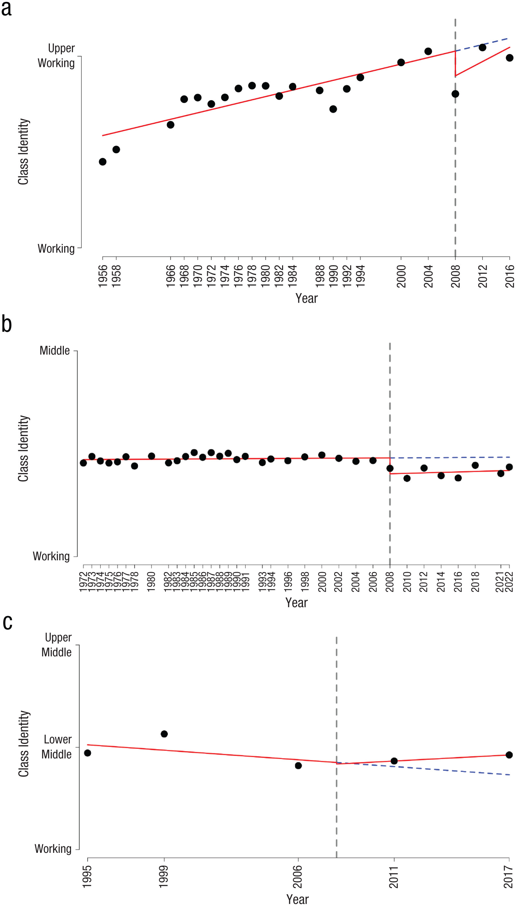
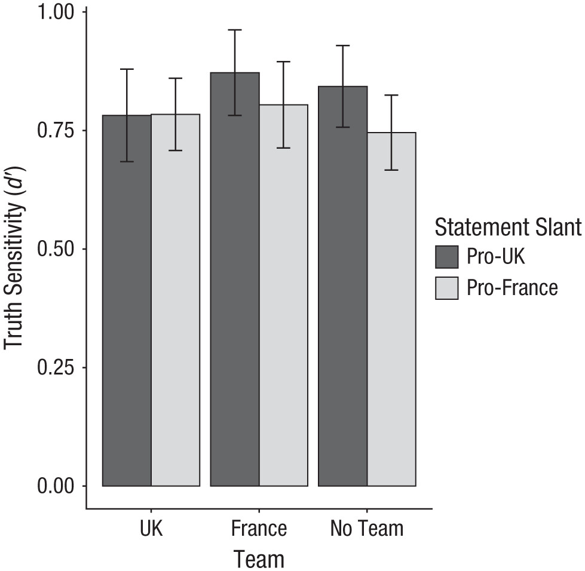

## Setup {visibility="hidden"}

```{r}
#| include: false
library(tidyverse)
library(patchwork)

sleep_study <- read_csv("../files/data/sleep_study.csv") |>
  mutate(sleep_group = factor(sleep_group,
                              levels = c("Short (<6)", "Medium (6-7)", "Long (7+)")))
```

# Why storytelling? {background-color="#2c3e50"}

::: {.notes}
Welcome back — Monday was Memorial Day, so a full week since Session 15 (joins). Today: Session 16, Storytelling with Data. Assignment 7 (joins + missing data) due Sunday; Assignment 8 (Storytelling Report) assigned today. Distribute APA figure handout at start of class. Structure: ~10 min opening, ~30 min "five audiences" spine, ~15 min pair coding, ~10 min misleading figures, ~10 min sequencing + famous stories, ~5 min critique exercise, ~5 min wrap.
:::

## Data alone isn't enough

You've learned to:

- Import and clean data
- Transform and summarize
- Create visualizations
- Handle missing data

. . .

But **technical skills ≠ communication skills**

::: {.notes}
~2 min. Pivot moment — acknowledge what they've built, reframe. Incremental reveal makes the punchline land: necessary but not sufficient.
:::

## The data storytelling triad

```{r}
#| echo: false
#| fig-width: 7
#| fig-height: 5
#| fig-align: center
#| fig-alt: "Venn diagram showing three overlapping circles for Data, Narrative, and Visuals. Where all three overlap, the word CHANGE appears, illustrating that effective data storytelling requires all three components."
library(ggforce)

triad <- tibble(
  x = c(-0.8, 0.8, 0),
  y = c(-0.3, -0.3, 0.8),
  label = c("Data", "Narrative", "Visuals")
)

ggplot(triad) +
  geom_circle(aes(x0 = x, y0 = y, r = 1.1, fill = label),
              alpha = 0.2, color = NA) +
  scale_fill_manual(values = c("Data" = "#3498db",
                                "Narrative" = "#e74c3c",
                                "Visuals" = "#2ecc71")) +
  annotate("text", x = -1.3, y = -0.8, label = "Data", fontface = "bold", size = 5) +
  annotate("text", x = 1.3, y = -0.8, label = "Narrative", fontface = "bold", size = 5) +
  annotate("text", x = 0, y = 1.5, label = "Visuals", fontface = "bold", size = 5) +
  annotate("text", x = 0, y = -0.6, label = "Explain", size = 4, color = "grey30") +
  annotate("text", x = -0.55, y = 0.4, label = "Enlighten", size = 4, color = "grey30") +
  annotate("text", x = 0.55, y = 0.4, label = "Engage", size = 4, color = "grey30") +
  annotate("text", x = 0, y = 0.05, label = "CHANGE", fontface = "bold", size = 5) +
  coord_equal() +
  guides(fill = "none") +
  theme_void()
```

::: {.aside}
Adapted from Brent Dykes
:::

::: {.notes}
The Dykes triad from the assigned reading. ~3 min. Walk through each pair: Data + Visuals = Enlighten (dashboard). Data + Narrative = Explain (report). Visuals + Narrative = Engage (infographic). All three = CHANGE. Even in academic writing, you're trying to change what the reader believes.
:::

## Why stories work

**Stories are memorable:**

- 63% of people remember stories
- Only 5% remember statistics

. . .

**Stories are persuasive:**

- Charity brochure study: a story about one child raised 2x more donations than statistics about millions

. . .

**Decisions are emotional:**

- Stories engage emotions; data alone doesn't

::: {.notes}
Charity brochure is Slovic (2007) — identifiable victim effect. If pushback on "decisions are emotional," cite Damasio's somatic marker hypothesis.
:::

## Today's question

**You have one finding.** You can present it to:

- Other researchers
- Clinicians or health educators
- The general public
- A live audience at a conference

. . .

Is the figure the same for all of them?

. . .

**No. The data is. The figure isn't.**

::: {.notes}
The pivot into the spine. Same data, five audiences, five figures. "The data is one thing; the *figure* is an argument made for a specific reader."
:::

## Our case study

A simulated dataset of 200 college students:

- `sleep_hours` — average nightly sleep
- `gpa` — cumulative GPA
- `year`, `study_hours`, `caffeine_cups`

. . .

**The finding:**

> Each extra hour of nightly sleep is associated with about **+0.21 higher GPA**. Students who sleep 7+ hours average **3.39**; students who sleep less than 6 average **2.88**.

::: {.notes}
~2 min. State the finding plainly — the *honest* version. As we walk through the five audiences, the framing reshapes — call out where reshaping crosses into misleading. Keep this slide visible long enough that students notice the numbers: 0.21, 3.39, 2.88, 0.5 GPA difference.
:::

## Loading the data — follow along

Paste this in your console to get the dataset.

```{r}
#| eval: false
library(tidyverse)

sleep_study <- read_csv(
  "https://raw.githubusercontent.com/sjweston/datasci410/main/files/data/sleep_study.csv"
) |>
  mutate(sleep_group = factor(sleep_group,
                              levels = c("Short (<6)",
                                         "Medium (6-7)",
                                         "Long (7+)")))
```

::: {.callout-note}
The data are **simulated** — 200 fake students with a known sleep–GPA relationship built in. Code that made them: [`scripts/generate-sleep-study.R`](https://github.com/sjweston/datasci410/blob/main/scripts/generate-sleep-study.R).
:::

::: {.notes}
~2 min. Have students paste the chunk and confirm it loads. Mention briefly that the data are simulated — we built in a known sleep–GPA effect so we can see how the same finding plays differently for different audiences. The factor() call sets the order of the sleep groups so the bar chart later goes Short → Medium → Long; without it, ggplot would alphabetize them. If anyone wants to see how the data were made, point them at the script.
:::

# Same finding, five audiences {background-color="#2c3e50"}

::: {.notes}
~30 min spine. Five audiences, five figures, each teaching one new annotation skill. The payoff is cumulative: by the end they should see that the choice of figure *is* the choice of argument.
:::

## Audience 1: You

You're mid-analysis. You need to know what's there.

. . .

- **Audience:** yourself
- **Question:** is there anything here?
- **Quality bar:** legible, fast
- **Annotation:** none

::: {.notes}
The first deliverable has no annotation. The lesson: exploratory work is for you. Don't polish what nobody will see.
:::

## For you: just look

```{r}
#| fig-width: 7
#| fig-height: 4
#| fig-align: center
#| fig-alt: "Quick exploratory scatterplot of sleep hours against GPA with a default smoother. Minimal styling, no annotation, no axis polish."
ggplot(sleep_study, aes(x = sleep_hours, y = gpa)) +
  geom_point() +
  geom_smooth()
```

::: {.notes}
Show this and pause. It's *not pretty* — and that's the point. Ask: "Would you put this in a paper?" No. "Would you ever look at it?" Constantly.
:::

## Audience 2: Researchers

A reader of a published paper.

. . .

- **Audience:** other psychologists
- **Question:** how strong is the effect, with what precision?
- **Quality bar:** APA-style, statistical detail, descriptive title
- **New skill:** in-plot statistics with `annotate(..., parse = TRUE)`

::: {.notes}
~2 min setup. Researchers want effect sizes and CIs, not assertions. Title describes; doesn't conclude. Most "neutral" of the five.
:::

## For researchers: a journal figure

```{r}
#| echo: false
#| fig-width: 7
#| fig-height: 4.5
#| fig-align: center
#| fig-alt: "APA-style scatterplot of sleep hours against GPA with a linear regression line and shaded 95% confidence interval. Statistical annotations show r = 0.56, beta = 0.21, N = 200."
ggplot(sleep_study, aes(x = sleep_hours, y = gpa)) +
  geom_point(alpha = 0.5, color = "gray40") +
  geom_smooth(method = "lm", color = "black", fill = "gray80") +
  annotate("text", x = 4.6, y = 3.95,
           label = "italic(r) == 0.56", parse = TRUE, hjust = 0, size = 4.2) +
  annotate("text", x = 4.6, y = 3.80,
           label = "beta == 0.21", parse = TRUE, hjust = 0, size = 4.2) +
  annotate("text", x = 4.6, y = 3.65,
           label = "italic(N) == 200", parse = TRUE, hjust = 0, size = 4.2) +
  labs(
    title = "Figure 1",
    subtitle = "Cumulative GPA by average nightly sleep duration in college students",
    x = "Average nightly sleep (hours)",
    y = "Cumulative GPA",
    caption = "Note. Shaded region represents 95% confidence interval. N = 200."
  ) +
  scale_x_continuous(breaks = 4:10) +
  coord_cartesian(ylim = c(1.5, 4)) +
  theme_classic(base_size = 12) +
  theme(
    plot.title = element_text(face = "bold"),
    plot.subtitle = element_text(face = "italic"),
    plot.caption = element_text(hjust = 0, face = "italic", size = 10)
  )
```

## The new move: stats annotation

```{r}
#| eval: false
annotate("text", x = 4.6, y = 3.95,
         label = "italic(r) == 0.56",
         parse = TRUE, hjust = 0, size = 4.2)
```

. . .

- `annotate()` adds text without needing a data frame
- `parse = TRUE` reads the label as an R expression — math notation, Greek letters
- `==` (not `=`) for equality in plotmath

::: {.notes}
`parse = TRUE` lets you typeset proper math. Quick alternative: `label = "r = 0.56"` produces plain text. Plotmath version (italic r, real equals) looks publication-grade. See `?plotmath` for the rest.
:::

## Full code: journal figure

```{r}
#| eval: false
ggplot(sleep_study, aes(x = sleep_hours, y = gpa)) +
  geom_point(alpha = 0.5, color = "gray40") +
  geom_smooth(method = "lm", color = "black", fill = "gray80") +
  annotate("text", x = 4.6, y = 3.95,
           label = "italic(r) == 0.56", parse = TRUE, hjust = 0, size = 4.2) +
  annotate("text", x = 4.6, y = 3.80,
           label = "beta == 0.21", parse = TRUE, hjust = 0, size = 4.2) +
  annotate("text", x = 4.6, y = 3.65,
           label = "italic(N) == 200", parse = TRUE, hjust = 0, size = 4.2) +
  labs(
    title = "Figure 1",
    subtitle = "Cumulative GPA by average nightly sleep duration in college students",
    x = "Average nightly sleep (hours)",
    y = "Cumulative GPA",
    caption = "Note. Shaded region represents 95% CI. N = 200."
  ) +
  scale_x_continuous(breaks = 4:10) +
  coord_cartesian(ylim = c(1.5, 4)) +
  theme_classic(base_size = 12) +
  theme(plot.title = element_text(face = "bold"),
        plot.subtitle = element_text(face = "italic"))
```

::: {.notes}
The full code is here so students can copy and modify. Don't read it aloud — point out that the structure is just: data → geoms → annotations → labels → scales → theme. Each annotate call places one label.
:::

## Audience 3: Clinicians

An academic advisor making a flyer or running a wellness workshop.

. . .

- **Audience:** practitioners
- **Question:** what should I do about this?
- **Quality bar:** at-a-glance, one clear message
- **New skill:** `geom_text()` direct labels + highlight + assertion title

::: {.notes}
Practitioners need a takeaway, not a regression coefficient. Title makes a claim. One bar highlighted. Direct labels mean no axis-reading needed.
:::

## For clinicians: a one-pager

```{r}
#| echo: false
#| fig-width: 7
#| fig-height: 4.5
#| fig-align: center
#| fig-alt: "Bar chart of mean GPA by sleep group. Short sleepers bar is highlighted in red; Medium and Long bars are gray. Bar values labeled directly above each bar: 2.88, 3.15, 3.39. No gridlines. Assertion title states short sleepers earn nearly half a letter grade less."
group_means <- sleep_study |>
  group_by(sleep_group) |>
  summarize(mean_gpa = mean(gpa), .groups = "drop") |>
  mutate(highlight = sleep_group == "Short (<6)")

ggplot(group_means, aes(x = sleep_group, y = mean_gpa, fill = highlight)) +
  geom_col(width = 0.65) +
  geom_text(aes(label = sprintf("%.2f", mean_gpa)),
            vjust = -0.6, size = 5.5, fontface = "bold", color = "gray20") +
  scale_fill_manual(values = c(`TRUE` = "#c0392b", `FALSE` = "gray70")) +
  scale_y_continuous(limits = c(0, 4), breaks = 0:4,
                     expand = expansion(mult = c(0, 0.05))) +
  labs(
    title = "Short sleepers earn nearly half a letter grade less",
    subtitle = "Mean cumulative GPA by average nightly sleep (N = 200 college students)",
    x = NULL, y = "Mean GPA"
  ) +
  theme_classic(base_size = 14) +
  theme(
    legend.position = "none",
    plot.title = element_text(face = "bold", size = 16),
    plot.title.position = "plot"
  )
```

## The new move: direct labels

```{r}
#| eval: false
geom_text(aes(label = sprintf("%.2f", mean_gpa)),
          vjust = -0.6, size = 5.5, fontface = "bold")
```

. . .

- `geom_text()` puts one label per row of data
- `aes(label = ...)` says which column to display
- `sprintf("%.2f", x)` formats the number (2 decimal places)
- `vjust = -0.6` nudges the label *above* the bar

. . .

**Why direct labels?** The reader shouldn't need to look at the axis to know the value.

::: {.notes}
The sprintf and vjust pieces are unfamiliar to most students. We'll unpack each on the next two slides.
:::

## Understanding `sprintf()`

`sprintf()` formats numbers (and other values) into strings.

```{r}
sprintf("%.2f", 3.14159)   # two decimal places
sprintf("%.0f", 3.14159)   # rounded to integer
sprintf("%d hours", 7)     # %d for whole numbers
sprintf("GPA: %.2f", 3.39) # mix text and numbers
```

::: {.notes}
sprintf comes from C. Walk through one example aloud — `"%.2f"` is the *format string*; `3.14159` is the value getting formatted; the result is the string `"3.14"`. The next slide unpacks the format-string syntax.
:::

## `sprintf()` — reading the format string

| Piece | What it does |
|-------|--------------|
| `%` | "format a value here" |
| `.2` | two decimal places |
| `f` | floating-point number (decimal) |
| `d` | integer (no decimal) |
| `%%` | a literal `%` sign |

. . .

**Example:** `"%.1f%%"` → format the value with 1 decimal place, then add a literal `%`. Applied to `67.5` → `"67.5%"`.

::: {.notes}
Format strings feel cryptic but they're a tiny language: `%` opens a slot, the next characters describe what kind of value to format. Students rarely need more than `%.2f`, `%d`, and `%%`. Point them at `?sprintf` for the rest.
:::

## Understanding `vjust`

`vjust` controls how the label sits relative to its anchor point.

| `vjust` value | What happens |
|---------------|--------------|
| `1` | label's **top** sits at the data point (label extends down) |
| `0.5` | label is **centered** on the data point |
| `0` | label's **bottom** sits at the data point (label extends up) |
| `-0.6` | label floats **above** the data point with a gap |

. . .

The trick: `vjust` is "how much of the label is **below** the anchor." Negative values lift the label *up* off the data point.

::: {.notes}
This is the part everyone trips on. The mental model: vjust is "fraction of label that sits below the data point." So vjust = 0.5 splits 50/50 (centered). vjust = 0 puts none below (label extends up). vjust = -0.6 means -60% is below — i.e., the label floats 60% of its own height above the bar. Demo on the next slide.
:::

## Seeing `vjust` in action

```{r}
#| echo: false
#| fig-width: 8
#| fig-height: 3.5
#| fig-align: center
#| fig-alt: "Three bars side by side, each with a label positioned differently. The first label sits at vjust=1 (top of label at bar top), the second at vjust=0 (bottom of label at bar top, touching it), the third at vjust=-0.6 (label floats above the bar with a clear gap)."
vjust_demo <- tibble(
  x = c("vjust = 1", "vjust = 0", "vjust = -0.6"),
  y = c(3, 3, 3),
  v = c(1, 0, -0.6)
)

ggplot(vjust_demo, aes(x = factor(x, levels = x), y = y)) +
  geom_col(fill = "steelblue", width = 0.5) +
  geom_text(aes(label = "3.00", vjust = v),
            size = 6, fontface = "bold", color = "darkred") +
  scale_y_continuous(limits = c(0, 4)) +
  labs(x = NULL, y = NULL) +
  theme_classic(base_size = 14)
```

::: {.notes}
This makes it concrete. Left: label sits inside the bar (top of label at bar top). Middle: label touches the bar top (bottom of label at bar top). Right: label floats above with a gap. For bar-chart direct labels, you almost always want a small negative vjust like -0.3 to -0.6.
:::

## Full code: clinician one-pager

```{r}
#| eval: false
group_means <- sleep_study |>
  group_by(sleep_group) |>
  summarize(mean_gpa = mean(gpa), .groups = "drop") |>
  mutate(highlight = sleep_group == "Short (<6)")

ggplot(group_means, aes(x = sleep_group, y = mean_gpa, fill = highlight)) +
  geom_col(width = 0.65) +
  geom_text(aes(label = sprintf("%.2f", mean_gpa)),
            vjust = -0.6, size = 5.5, fontface = "bold", color = "gray20") +
  scale_fill_manual(values = c(`TRUE` = "#c0392b", `FALSE` = "gray70")) +
  scale_y_continuous(limits = c(0, 4), breaks = 0:4,
                     expand = expansion(mult = c(0, 0.05))) +
  labs(
    title = "Short sleepers earn nearly half a letter grade less",
    subtitle = "Mean cumulative GPA by average nightly sleep (N = 200)",
    x = NULL, y = "Mean GPA"
  ) +
  theme_classic(base_size = 14) +
  theme(legend.position = "none",
        plot.title = element_text(face = "bold", size = 16))
```

::: {.notes}
The full code for students to copy. The pieces: summarize down to 3 rows → set highlight flag → bar chart → direct labels → custom fill colors → assertion title → classic theme. Highlight the highlight pattern (`if_else` in a mutate, then `scale_fill_manual`) — it's the workhorse for "make one thing pop."
:::

## Audience 4: The public

Someone scrolling a feed for two seconds.

. . .

- **Audience:** general public
- **Question:** is there a number I should remember?
- **Quality bar:** one number, square format, brand-bold
- **New skill:** text-as-data — ggplot without a chart

::: {.notes}
Boldest stylistic move. The "figure" is mostly typography. The point: ggplot's drawing surface is general — you don't have to have a `geom_point()` in there at all.
:::

## For the public: a social card

```{r}
#| echo: false
#| fig-width: 5
#| fig-height: 5
#| fig-align: center
#| fig-alt: "Square social-media graphic on a dark navy background. Large white text reads plus 0.5 GPA points. Subtitle: students who sleep 7+ hours earn higher grades than those who sleep less than 6. Decorative green underline. Small caption: PSY 410, N = 200."
ggplot() +
  annotate("text", x = 0.5, y = 0.78,
           label = "+0.5", size = 38, fontface = "bold",
           color = "white", hjust = 0.5) +
  annotate("text", x = 0.5, y = 0.60,
           label = "GPA points", size = 9,
           color = "white", hjust = 0.5) +
  annotate("text", x = 0.5, y = 0.40,
           label = "Students who sleep 7+ hours earn\nhigher grades than those who sleep < 6",
           size = 5.5, color = "white", hjust = 0.5, lineheight = 1.2) +
  annotate("segment", x = 0.25, xend = 0.75, y = 0.20, yend = 0.20,
           color = "#2ecc71", linewidth = 1.2) +
  annotate("text", x = 0.5, y = 0.13,
           label = "PSY 410  ·  N = 200", size = 3.8,
           color = "gray70", hjust = 0.5, fontface = "italic") +
  xlim(0, 1) + ylim(0, 1) +
  coord_fixed() +
  theme_void() +
  theme(
    plot.background = element_rect(fill = "#1a2942", color = NA),
    panel.background = element_rect(fill = "#1a2942", color = NA),
    plot.margin = margin(20, 20, 20, 20)
  )
```

## The new move: text-as-data

```{r}
#| eval: false
ggplot() +
  annotate("text", x = 0.5, y = 0.78,
           label = "+0.5", size = 38, fontface = "bold",
           color = "white") +
  xlim(0, 1) + ylim(0, 1) +
  theme_void() +
  theme(plot.background = element_rect(fill = "#1a2942"))
```

. . .

- `ggplot()` with no data — the canvas is empty
- `annotate()` places elements at chosen coordinates
- `theme_void()` removes axes and gridlines
- `plot.background` paints the canvas

. . .

**A figure doesn't have to contain a "chart."**

::: {.notes}
Students often haven't realized ggplot can do this. The "figure" still encodes a number (+0.5) — the number IS the figure. Ask: "Is this honest?" Yes — number is real. "Is it the whole story?" No — but it doesn't claim to be.
:::

## Full code: social card

```{r}
#| eval: false
ggplot() +
  annotate("text", x = 0.5, y = 0.78,
           label = "+0.5", size = 38, fontface = "bold",
           color = "white", hjust = 0.5) +
  annotate("text", x = 0.5, y = 0.60,
           label = "GPA points", size = 9,
           color = "white", hjust = 0.5) +
  annotate("text", x = 0.5, y = 0.40,
           label = "Students who sleep 7+ hours earn\nhigher grades than those who sleep < 6",
           size = 5.5, color = "white", hjust = 0.5, lineheight = 1.2) +
  annotate("segment", x = 0.25, xend = 0.75, y = 0.20, yend = 0.20,
           color = "#2ecc71", linewidth = 1.2) +
  annotate("text", x = 0.5, y = 0.13,
           label = "PSY 410  ·  N = 200", size = 3.8,
           color = "gray70", hjust = 0.5, fontface = "italic") +
  xlim(0, 1) + ylim(0, 1) +
  coord_fixed() +
  theme_void() +
  theme(
    plot.background = element_rect(fill = "#1a2942", color = NA),
    panel.background = element_rect(fill = "#1a2942", color = NA),
    plot.margin = margin(20, 20, 20, 20)
  )
```

::: {.notes}
Five `annotate()` calls (four text, one segment) build the whole card. Each one is positioned with x/y coordinates between 0 and 1 (because we set `xlim(0, 1)`). Walk through one annotate call in detail — the rest are just variations on the same pattern with different sizes and positions.
:::

## A note on honest framing

| Framing | What it actually means |
|---------|------------------------|
| "β = 0.21" | The journal version |
| "0.5 GPA gap" | The clinician version |
| "Higher grades" | The social card |

. . .

All true. **Each chooses how much detail to drop.**

. . .

Drop too much and you cross into misleading. We'll come back to this.

::: {.notes}
Flags the ethical dimension of audience-tailoring. "Higher grades" is true; "Sleep makes you smarter" would not be. Foreshadow the misleading-figures section. ~2 min.
:::

## Audience 5: A live audience

A roomful of people during a 30-second slide in your talk.

. . .

- **Audience:** conference attendees
- **Question:** what's the headline?
- **Quality bar:** readable from the back row
- **New skill:** `geom_vline()`, `annotate("rect")`, `annotate("label")`

::: {.notes}
Live audiences can't slow down. Slide must work in seconds. Reference lines + shaded regions + on-plot callouts do the work of axis-reading for them.
:::

## For a talk: one slide, one point

```{r}
#| echo: false
#| fig-width: 8
#| fig-height: 4.8
#| fig-align: center
#| fig-alt: "Large scatterplot of sleep hours vs GPA with regression line. A dashed green vertical line marks 7 hours and the region from 7 to 9 hours is shaded light green as the recommended zone. Two on-plot callouts highlight the effect size and recommended sleep."
ggplot(sleep_study, aes(x = sleep_hours, y = gpa)) +
  annotate("rect", xmin = 7, xmax = 9.5, ymin = -Inf, ymax = Inf,
           fill = "#2ecc71", alpha = 0.10) +
  geom_point(alpha = 0.4, color = "gray50", size = 2) +
  geom_smooth(method = "lm", color = "#2c3e50", linewidth = 1.4, se = FALSE) +
  geom_vline(xintercept = 7, linetype = "dashed",
             color = "#2ecc71", linewidth = 0.8) +
  annotate("label", x = 8.25, y = 2.1,
           label = "Recommended\n7+ hours",
           color = "#27ae60", fontface = "bold", size = 5,
           label.size = 0, fill = "white", lineheight = 1) +
  annotate("label", x = 5.4, y = 3.85,
           label = "Every extra hour\n= +0.2 GPA",
           color = "#2c3e50", fontface = "bold", size = 5.5,
           label.size = 0, fill = "#ecf0f1", lineheight = 1) +
  labs(
    title = "More sleep, higher grades",
    x = "Nightly sleep (hours)", y = "Cumulative GPA"
  ) +
  scale_x_continuous(breaks = 4:10) +
  coord_cartesian(ylim = c(1.5, 4)) +
  theme_minimal(base_size = 18) +
  theme(
    plot.title = element_text(face = "bold", size = 26),
    panel.grid.minor = element_blank(),
    axis.title = element_text(color = "gray40")
  )
```

## The new move: reference + region + callout

```{r}
#| eval: false
annotate("rect", xmin = 7, xmax = 9.5,
         ymin = -Inf, ymax = Inf,
         fill = "#2ecc71", alpha = 0.10) +
geom_vline(xintercept = 7, linetype = "dashed", color = "#2ecc71") +
annotate("label", x = 5.4, y = 3.85,
         label = "Every extra hour\n= +0.2 GPA",
         label.size = 0, fill = "#ecf0f1")
```

. . .

- `annotate("rect", ...)` draws a shaded region (use `-Inf`/`Inf` to span the panel)
- `geom_vline()` adds a reference line at a value
- `annotate("label", ...)` is `annotate("text")` with a background

::: {.notes}
The shaded region (7+ as "recommended") is editorial — the data doesn't define 7 as the cutoff; the public health literature does. That's exactly the kind of move students need to recognize in others' work. Honest if you cite the source, less honest if you imply the data alone defines the threshold.
:::

## Full code: talk slide

```{r}
#| eval: false
ggplot(sleep_study, aes(x = sleep_hours, y = gpa)) +
  annotate("rect", xmin = 7, xmax = 9.5, ymin = -Inf, ymax = Inf,
           fill = "#2ecc71", alpha = 0.10) +
  geom_point(alpha = 0.4, color = "gray50", size = 2) +
  geom_smooth(method = "lm", color = "#2c3e50", linewidth = 1.4, se = FALSE) +
  geom_vline(xintercept = 7, linetype = "dashed",
             color = "#2ecc71", linewidth = 0.8) +
  annotate("label", x = 8.25, y = 2.1,
           label = "Recommended\n7+ hours",
           color = "#27ae60", fontface = "bold", size = 5,
           label.size = 0, fill = "white", lineheight = 1) +
  annotate("label", x = 5.4, y = 3.85,
           label = "Every extra hour\n= +0.2 GPA",
           color = "#2c3e50", fontface = "bold", size = 5.5,
           label.size = 0, fill = "#ecf0f1", lineheight = 1) +
  labs(title = "More sleep, higher grades",
       x = "Nightly sleep (hours)", y = "Cumulative GPA") +
  scale_x_continuous(breaks = 4:10) +
  coord_cartesian(ylim = c(1.5, 4)) +
  theme_minimal(base_size = 18) +
  theme(plot.title = element_text(face = "bold", size = 26))
```

::: {.notes}
Notice the layering order matters: the shaded rect goes FIRST (bottom), then points, then the smoothing line, then the vline, then the labels on top. ggplot draws in order, so later layers sit above earlier ones.
:::

## What you now have

| Audience | Annotation skill |
|----------|------------------|
| You | (restraint) |
| Researchers | `annotate(..., parse = TRUE)` for stats |
| Clinicians | `geom_text()` direct labels + highlight |
| Public | Text-as-data with `theme_void()` |
| Live audience | `geom_vline()` + `annotate("rect")` + `annotate("label")` |

. . .

**Five figures. One finding. One R skill toolkit.**

::: {.notes}
Closer for the spine. Don't read the table — let students read it. The R toolkit is genuinely new — these are the annotation skills that turn a chart into an argument.
:::

## Your annotation toolbox

| Tool | When to use |
|------|-------------|
| `annotate("text", ...)` | One-off text at coordinates (use `parse = TRUE` for math) |
| `annotate("label", ...)` | Same, with a background box |
| `annotate("rect", ...)` | Shaded region (e.g., a "recommended zone") |
| `annotate("segment", ...)` | Line or arrow between two points |
| `geom_text(aes(label = ...))` | Label every row of data (use `sprintf()` to format) |
| `geom_vline()` / `geom_hline()` | Vertical / horizontal reference line |
| `geom_abline()` | Reference line with a slope (e.g., y = x) |
| `ggrepel::geom_text_repel()` | Labels that auto-arrange to avoid overlap |

::: {.notes}
~2 min. A cheat sheet they can come back to. The first five we used in class; the last three are common moves they'll encounter in other people's code or want in their final project. ggrepel is the one most worth flagging — once they have more than a few labels, manual `geom_text` overlaps and `geom_text_repel` fixes it.
:::

# Pair coding break {background-color="#e67e22"}

## Your turn: two audiences

Pick **one figure from your final project draft**. (If you don't have one, use any figure from a recent assignment.)

. . .

Produce **two versions**:

1. **For your professor** — what would go in your final report
2. **For your roommate** — a single image you'd text them with the takeaway

. . .

Use at least one annotation technique from today on each version.

**Time: 12 minutes**

::: {.notes}
~12 minutes. The "your roommate" framing forces them to think about an audience with zero context. If stuck on which figure, pick any from A3-A7. Walk around. Common sticking point: they default to making both versions look similar. Push them: "If your roommate already understood the data, why would you text them?"
:::

## Before we move on

📤 **[Submit your code on Canvas](https://canvas.uoregon.edu/courses/287793/pages/pair-coding-check-ins)** for participation credit. Paste what you have — both versions don't need to be polished.

# Misleading figures {background-color="#2c3e50"}

::: {.notes}
~10 min. Connects back to "honest framing" and to S1's replication-crisis opener. The audience-tailoring lesson has a dark twin.
:::

## The same move, weaponized

Every annotation we just learned can also mislead:

- Reference lines that imply causation
- Shaded regions that suggest a threshold the data doesn't support
- Direct labels that hide the spread
- Assertion titles that overstate

. . .

The skill is knowing when you've crossed the line.

::: {.notes}
Bridge from spine to misleading-figures. The tools are the same — what changes is intent and fidelity to the data.
:::

## Common deceptions

1. **Truncated y-axes** — exaggerate small differences
2. **Dual axes** — imply false relationships
3. **Cherry-picked ranges** — hide broader trends
4. **3D and area charts** — distort comparisons

::: {.notes}
Truncated y-axes are most common in psych and easiest to demo. Invite students to share examples from news or social media.
:::

## Example: a truncated y-axis

```{r}
#| echo: false
#| fig-width: 8
#| fig-height: 4
#| fig-align: center
#| fig-alt: "Two bar charts side by side. Left: y-axis from 15 to 19, makes treatment look dramatically better than control. Right: y-axis from 0, shows the 2-point difference is modest."
fake <- tibble(condition = c("Control", "Treatment"), score = c(18, 16))

p_misleading <- ggplot(fake, aes(x = condition, y = score)) +
  geom_col(fill = "steelblue") +
  coord_cartesian(ylim = c(15, 19)) +
  labs(title = "Misleading", subtitle = "y-axis: 15-19",
       x = NULL, y = "Depression") +
  theme_classic(base_size = 13)

p_honest <- ggplot(fake, aes(x = condition, y = score)) +
  geom_col(fill = "steelblue") +
  coord_cartesian(ylim = c(0, 25)) +
  labs(title = "Honest", subtitle = "y-axis: 0-25",
       x = NULL, y = "Depression") +
  theme_classic(base_size = 13)

p_misleading + p_honest
```

Same data. The left chart will get reposted; the right one won't.

::: {.notes}
`coord_cartesian(ylim = ...)` is the code-level move. Ask: "Is the left one *wrong*?" Strictly no — the data is the data. But bars encode magnitude, and a truncated bar implies a magnitude that isn't there.
:::

## When truncation is fine

✅ The baseline is non-zero (body temperature, blood pressure)

✅ You're showing change over time (line plot)

✅ You explicitly note it in the caption

. . .

❌ **Never truncate bar charts.** Bars encode magnitude — the bar must start at zero.

::: {.notes}
Bars must start at zero because the height *is* the value. Line charts can start anywhere because slope is what's encoded.
:::

# One figure isn't a story {background-color="#2c3e50"}

::: {.notes}
~10 min. The story arc is about sequencing figures. Final project framing — students produce both a written report and a video presentation.
:::

## A sequence makes the story

One figure shows a finding.

A **sequence** makes an argument:

- Set the stage
- Show the pattern
- Show what it means

. . .

Your final project is a sequence. Your video presentation is a sequence.

::: {.notes}
A single figure is a noun; a sequence is a sentence. Even a 5-minute video has 4-5 figures; their order is the argument.
:::

## Sequencing for a paper: sleep & GPA

**Build the reader up to your finding.**

```{r}
#| echo: false
#| fig-width: 12
#| fig-height: 3.5
#| fig-align: center
#| fig-alt: "Three small panels labeled 1, 2, 3 showing a paper sequence: descriptive distribution of sleep hours, scatterplot with regression line of sleep vs GPA, and bar chart of group means by sleep category."
p1 <- ggplot(sleep_study, aes(x = sleep_hours)) +
  geom_histogram(binwidth = 0.5, fill = "gray50", color = "white") +
  labs(title = "1. Descriptives", x = "Sleep (hours)", y = NULL) +
  theme_classic(base_size = 11)

p2 <- ggplot(sleep_study, aes(x = sleep_hours, y = gpa)) +
  geom_point(alpha = 0.4, color = "gray40", size = 1) +
  geom_smooth(method = "lm", color = "black", fill = "gray70") +
  labs(title = "2. The pattern", x = "Sleep (hours)", y = "GPA") +
  theme_classic(base_size = 11)

gm_paper <- sleep_study |>
  group_by(sleep_group) |>
  summarize(mean_gpa = mean(gpa), .groups = "drop")

p3 <- ggplot(gm_paper, aes(x = sleep_group, y = mean_gpa)) +
  geom_col(fill = "gray50") +
  geom_text(aes(label = sprintf("%.2f", mean_gpa)),
            vjust = -0.5, size = 3.5) +
  scale_y_continuous(limits = c(0, 4)) +
  labs(title = "3. The effect", x = NULL, y = "Mean GPA") +
  theme_classic(base_size = 10) +
  theme(axis.text.x = element_text(size = 8))

p1 + p2 + p3
```

**Order:** sample → relationship → effect size. Each figure earns the next.

::: {.notes}
Walk through left to right. The reader doesn't know the data yet, so figure 1 just shows the distributions exist. Figure 2 shows the relationship. Figure 3 quantifies the effect for groups they can act on. This is the journal convention — Figure 1 is usually descriptive, Figure 2 is the main effect, Figure 3 might be moderation or mechanism.
:::

## Sequencing for a talk: sleep & GPA

**Lead with the punchline.**

```{r}
#| echo: false
#| fig-width: 10
#| fig-height: 4
#| fig-align: center
#| fig-alt: "Two side-by-side panels showing a talk sequence: an annotated scatter with a shaded recommended zone (the headline), and a big-text callout instructing viewers to aim for 7+ hours of sleep (the action)."
t1 <- ggplot(sleep_study, aes(x = sleep_hours, y = gpa)) +
  annotate("rect", xmin = 7, xmax = 9.5, ymin = -Inf, ymax = Inf,
           fill = "#2ecc71", alpha = 0.12) +
  geom_point(alpha = 0.4, color = "gray50", size = 1) +
  geom_smooth(method = "lm", color = "#2c3e50",
              linewidth = 1, se = FALSE) +
  geom_vline(xintercept = 7, linetype = "dashed",
             color = "#2ecc71") +
  labs(title = "1. More sleep, higher grades",
       x = "Sleep (hours)", y = "GPA") +
  theme_minimal(base_size = 12)

t3 <- ggplot() +
  annotate("text", x = 0.5, y = 0.65, label = "Aim for",
           size = 7, color = "gray40", hjust = 0.5) +
  annotate("text", x = 0.5, y = 0.45, label = "7+ hours",
           size = 18, fontface = "bold",
           color = "#27ae60", hjust = 0.5) +
  annotate("text", x = 0.5, y = 0.25, label = "of sleep",
           size = 7, color = "gray40", hjust = 0.5) +
  xlim(0, 1) + ylim(0, 1) + coord_fixed() +
  labs(title = "2. The action") +
  theme_void(base_size = 12) +
  theme(plot.title = element_text(size = 12, hjust = 0.5))

t1 + t3
```

**Order:** headline → action. The headline figure carries the evidence; the action slide says what to do about it.

::: {.notes}
Walk through left to right. Talks lead with the answer because attention is fragile — bury the lede and you lose them. The headline (Audience 5) does double duty — it asserts the finding *and* shows the data. The action slide closes with what the audience should do. A talk doesn't need a separate "evidence" figure; the annotation on the headline already does that work.
:::

## Famous data stories: Nightingale

::: {.columns}
::: {.column width="55%"}
{fig-align="center" width="100%"}
:::

::: {.column width="45%"}
**Florence Nightingale (1858)**

Showed Parliament that more soldiers died of preventable disease than battle wounds. Changed military medicine.

The blue wedges (disease) dwarf the red (wounds). The visual carries the argument.

[Wikipedia article →](https://en.wikipedia.org/wiki/Florence_Nightingale#Statistics_and_sanitary_reform)
:::
:::

::: {.notes}
~2 min. The chart was politically motivated — Nightingale wanted to convince Parliament to fund sanitation reform. Color is the rhetorical move: blue = preventable, the visual answer is "the blue wedges are huge." She wrote that she designed it "to affect thro' the Eyes what we may fail to convey to the brains of the public through their word-proof ears." Storytelling, on purpose.
:::

## Famous data stories: Minard

{fig-align="center" width="100%"}

[Wikipedia article →](https://en.wikipedia.org/wiki/Charles_Joseph_Minard)

::: {.notes}
~2 min. The band shows Napoleon's army shrinking from ~422,000 to ~10,000. Edward Tufte called it possibly the best statistical graphic ever drawn. Six variables on one chart and you don't have to be told what happened — the visual *is* the story. Note the bottom strip shows temperature dropping as the army retreats. Storytelling through layered encoding.
:::

## Famous data stories: Rosling

**Hans Rosling — *200 Countries in 200 Years*** (4 min video)

A bubble chart of life expectancy vs. income, animated across two centuries.

He made global development legible to a general audience by adding **time** as a fourth dimension (animation).

[Watch the video →](https://www.youtube.com/watch?v=jbkSRLYSojo)

::: {.notes}
~2 min. If time permits, play 60 seconds of the video. Otherwise just plant it as something to watch later. The lesson is that motion-as-encoding can do work that static figures can't — but only because Rosling narrates the story while it animates. The chart alone is incomplete; chart + narration = story.
:::

## Apply this to your final project

Your final video presentation is a sequence:

- **Slide 1-2:** the question and why it matters
- **Slide 3-4:** what the data look like (descriptive)
- **Slide 5-6:** the main finding (with annotation)
- **Slide 7:** what we should do with it

. . .

Every figure earns the next. **Cut anything that doesn't.**

::: {.notes}
Concrete bridge to A8 and the final project. Storytelling isn't optional polish — it's the difference between a video the audience remembers and one they don't.
:::

# Critique exercise {background-color="#e67e22"}

::: {.notes}
~5 min total — give pairs 2-3 min per figure, then quick debrief. Students should diagnose audience, story, annotation moves, and how they'd redesign for a different audience. If time is short, do one figure together as a class and skip the second.
:::

## Critique these figures

For each:

1. Who is the audience?
2. What story is it trying to tell?
3. What annotation moves did the author make?
4. How would you redesign it for a *different* audience?

## Figure 1

{fig-align="center" height="400"}

## Figure 2

{fig-align="center" height="400"}

# Wrapping up {background-color="#2c3e50"}

::: {.notes}
~5 min. Quick — checklist, takeaways, admin, close.
:::

## The storytelling checklist

Before finalizing any figure, ask:

- [ ] **Who is the audience?** Researchers, practitioners, public, live?
- [ ] **What's the one message?** Can I state it in a sentence?
- [ ] **Is the title an assertion or a description?** Match it to the audience.
- [ ] **Did I use annotation to direct attention?**
- [ ] **Am I being honest?** No truncated bars, no implied thresholds the data doesn't support.
- [ ] **Does this figure earn its place in the sequence?**

## A note on APA formatting

You'll receive a handout on APA figure formatting.

. . .

- Journals have **different** requirements
- APA is a starting point, not gospel
- Focus on **clarity and communication** first

::: {.callout-note}
The handout covers the formal rules. Class time is better spent on clarity than on margin sizes.
:::

## Head start: Assignment 8

Start the reproducible report due next week. Pick **one** dataset: `palmerpenguins::penguins`, `psych::bfi`, a `nycflights13::flights` subset, or your final project data.

Build a minimal `.qmd` with:

1. YAML header including `author`, `date`, `toc: true`, `code-fold: true`
2. A 2-3 sentence intro stating your research question
3. A setup chunk + `glimpse()` of your data
4. **One** exploratory visualization with a caption
5. **One** annotation move from today (assertion title, highlight, callout, etc.)
6. Render to HTML to confirm it works end-to-end

::: {.callout-note}
A8 is **not** your final project. It's a short, focused reproducible report. Your final project is due June 10 and will be much more substantial.
:::

## Before next class

📖 **Read:**

- A short reading on correlation and simple regression — to be posted on Canvas

✅ **Do:**

- Work on **Assignment 8** (due Sunday May 31 at 11:59 PM)
- Keep moving on your **final project** (full submission due Wed Jun 3)
- Revise your figures using one audience-shaped version from today

## Heads up: The Final Prediction

Next session (Correlation & Regression) we'll reveal **Fun Challenge 10: The Final Prediction**.

A quick one — predict the correlation from a scatterplot. The deadline is **Tuesday at 11:59 PM**, so you'll have Monday in class to work on it with your team.

::: {.notes}
30-second mention. Plant the seed so teams aren't caught off guard.
:::

## Key takeaways

1. **Data + Visuals + Narrative = Change**
2. **The figure is an argument for a specific reader.** Five audiences → five figures.
3. **Annotation is your toolkit:** `annotate()`, `geom_text()`, `geom_vline()`, reference lines, shaded regions.
4. **Be honest** — the same techniques that clarify can also deceive.
5. **A sequence is a story.** One figure earns the next.

## The one thing to remember

A figure is an argument made for a reader.

Ask **"who's reading?"** before you ask **"what's the chart?"**

See you Monday for correlation and simple regression!
