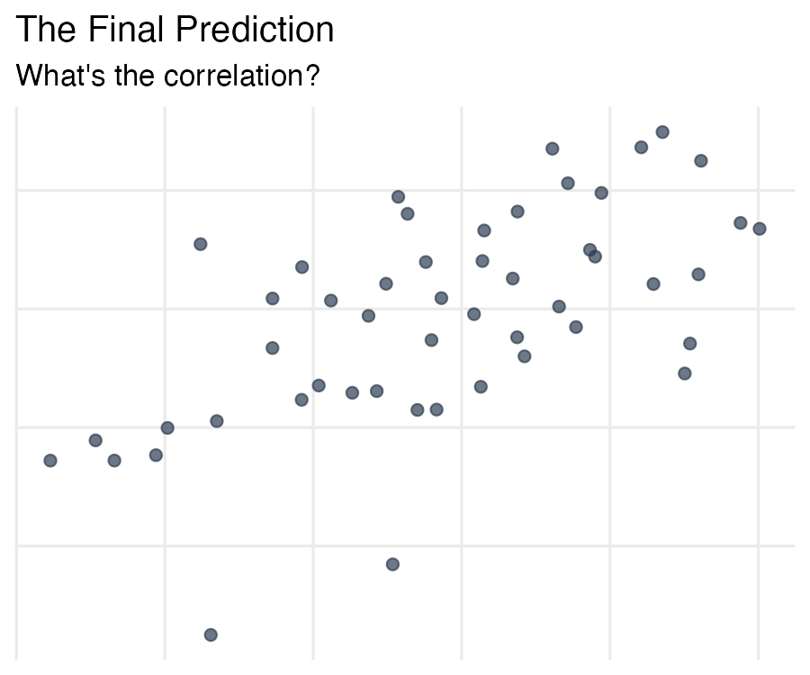

## Setup {visibility="hidden"}

```{r}
#| include: false
library(tidyverse)
library(broom)

# Load our class survey data
class_survey <- read_csv("../data/class_survey.csv")
```

# From patterns to numbers {background-color="#2c3e50"}

::: {.notes}
This session is a taste of modeling, not a stats unit. Set that expectation early: "We're not learning statistics today -- we're learning to put numbers on patterns you can already see." Students who've had stats may want to go deeper; redirect them to PSY 420 or STAT 510.
:::

## You've been eyeballing patterns for 16 sessions

```{r}
#| echo: false
#| fig-width: 8
#| fig-height: 4
#| fig-alt: "Scatterplot showing a positive trend between daily social media use (hours) and anxiety scores (GAD-7), with points loosely clustering upward from left to right."
set.seed(410)
study_data <- tibble(
  participant_id = 1:120,
  hours_social_media = rnorm(120, 4, 1.5),
  gad7_total = 3 + 1.2 * hours_social_media + rnorm(120, 0, 3),
  phq9_total = 5 + 0.8 * hours_social_media + rnorm(120, 0, 4),
  therapy_hours = rnorm(120, 12, 4),
  depression_post = 25 - 0.9 * therapy_hours + rnorm(120, 0, 3)
) |>
  mutate(across(c(gad7_total, phq9_total, depression_post), ~ pmax(.x, 0)))

ggplot(study_data, aes(x = hours_social_media, y = gad7_total)) +
  geom_point(alpha = 0.5, color = "gray50") +
  labs(
    title = "Does social media use predict anxiety?",
    x = "Daily social media use (hours)",
    y = "Anxiety score (GAD-7)"
  ) +
  theme_minimal(base_size = 14)
```

. . .

Today you learn to put a **number** on that pattern.

::: {.notes}
Spend about 2 minutes here. Let the plot sit for a moment before advancing. Ask the class: "What do you see? Is there a pattern?" Let a few students answer. The point is they can already detect the relationship visually -- today's tools just formalize what their eyes already know.
:::

## The same plot — with a number

```{r}
#| echo: false
#| fig-width: 8
#| fig-height: 4
#| fig-alt: "Scatterplot of social media use versus anxiety with a blue trend line and correlation coefficient annotation, showing a moderate positive relationship."
r_val <- cor(study_data$hours_social_media, study_data$gad7_total)

ggplot(study_data, aes(x = hours_social_media, y = gad7_total)) +
  geom_point(alpha = 0.5, color = "gray50") +
  geom_smooth(method = "lm", color = "steelblue", se = FALSE) +
  annotate("text", x = 7, y = 5,
           label = paste0("r = ", round(r_val, 2)),
           size = 6, color = "steelblue", fontface = "bold") +
  labs(
    title = "Does social media use predict anxiety?",
    x = "Daily social media use (hours)",
    y = "Anxiety score (GAD-7)"
  ) +
  theme_minimal(base_size = 14)
```

**Correlation** measures the strength and direction. **Regression** draws the line.

::: {.notes}
This slide is the thesis for the whole session. Emphasize the distinction: correlation gives a single number summarizing the relationship; regression gives an equation that lets you predict. Both tell you the same story in different ways.
:::

# Correlation {background-color="#2c3e50"}

## What correlation measures

**Correlation (r)** quantifies the **linear relationship** between two variables.

| Value of r | Interpretation |
|-----------|----------------|
| r = 1.0   | Perfect positive |
| r = 0.7   | Strong positive |
| r = 0.3   | Weak positive |
| r = 0.0   | No linear relationship |
| r = -0.3  | Weak negative |
| r = -0.7  | Strong negative |
| r = -1.0  | Perfect negative |

. . .

**Key:** r tells you **direction** and **strength**, not causation.

::: {.notes}
Spend ~3 minutes on this table. Students often ask what counts as "strong" vs. "weak" -- emphasize that these labels are rough guidelines, and that what's "strong" depends on the field. In psychology, r = 0.3 is often considered meaningful. Don't get bogged down in formulas; focus on the intuition of "closer to 1 or -1 means tighter clustering around a line."
:::

## cor() in R

```{r}
cor(study_data$hours_social_media, study_data$gad7_total)
```

. . .

That's it. One function, two variables, one number.

. . .

```{r}
# You can also use it inside a pipeline
study_data |>
  summarize(r = cor(hours_social_media, gad7_total))
```

::: {.notes}
This is a good moment to demo live. Type the code rather than just advancing the slide. Students may ask about the dollar-sign syntax vs. the pipeline version -- briefly explain both work, but the pipeline version is consistent with what they've been doing all quarter. If anyone asks about Pearson vs. Spearman, acknowledge the distinction but say Pearson is the default and all we need today.
:::

## This is what geom_smooth() has been doing

Every time you wrote `geom_smooth(method = "lm")`, you were fitting a line through the data.

```{r}
#| output-location: slide
#| fig-alt: "Scatterplot with a linear trend line and confidence band showing that higher social media use is associated with higher GAD-7 anxiety scores."
ggplot(study_data, aes(x = hours_social_media, y = gad7_total)) +
  geom_point(alpha = 0.5) +
  geom_smooth(method = "lm", color = "steelblue") +
  labs(
    title = "Social media use and anxiety",
    x = "Daily social media use (hours)",
    y = "Anxiety score (GAD-7)"
  ) +
  theme_minimal()
```

::: {.notes}
This is a satisfying callback. Students have been writing geom_smooth(method = "lm") since Session 2 without knowing what it does mathematically. Point out that they've been fitting regression lines all along -- today they're just learning to read the numbers behind them.
:::

## cor.test() — is it statistically significant?

```{r}
cor.test(study_data$hours_social_media, study_data$gad7_total)
```

. . .

**What to report:** r, p-value, and 95% confidence interval.

::: {.notes}
Walk through the output slowly. Students often feel overwhelmed by dense console output. Point out the three things they need: the r value (cor), the p-value, and the confidence interval. You don't need to explain degrees of freedom or the test statistic. Common question: "What does a small p-value mean?" Keep it simple: "It means this relationship is unlikely to be due to chance alone."
:::

## Correlation matrix: multiple variables at once

```{r}
study_data |>
  select(hours_social_media, gad7_total, phq9_total, therapy_hours) |>
  cor(use = "complete.obs") |>
  round(2)
```

. . .

Each cell is the correlation between the row variable and the column variable. The diagonal is always 1 (a variable correlates perfectly with itself).

::: {.notes}
Point out two features: the diagonal of 1s (a variable always correlates perfectly with itself) and the symmetry (top-right mirrors bottom-left). Ask students to find the strongest relationship in the matrix. Note the use = "complete.obs" argument -- briefly mention this handles missing data by using only complete pairs, connecting back to Session 15.
:::

## Visualizing a correlation matrix

```{r}
#| output-location: slide
#| fig-width: 6
#| fig-height: 5
#| fig-alt: "Heatmap of a correlation matrix for four variables (social media hours, GAD-7, PHQ-9, therapy hours) with color ranging from red (negative) to blue (positive) and correlation values displayed in each cell."
cor_matrix <- study_data |>
  select(hours_social_media, gad7_total, phq9_total, therapy_hours) |>
  cor(use = "complete.obs")

# Manual heatmap with ggplot
cor_matrix |>
  as.data.frame() |>
  rownames_to_column("var1") |>
  pivot_longer(-var1, names_to = "var2", values_to = "r") |>
  ggplot(aes(x = var1, y = var2, fill = r)) +
  geom_tile() +
  geom_text(aes(label = round(r, 2)), size = 4) +
  scale_fill_gradient2(low = "#e74c3c", mid = "white", high = "#2c3e50",
                       midpoint = 0, limits = c(-1, 1)) +
  labs(title = "Correlation matrix", x = NULL, y = NULL) +
  theme_minimal() +
  theme(axis.text.x = element_text(angle = 45, hjust = 1))
```

## Correlation does NOT mean causation

```{r}
#| echo: false
#| fig-width: 8
#| fig-height: 3.5
tibble(
  example = c("Ice cream sales & drowning deaths",
              "Shoe size & reading ability",
              "Social media & anxiety"),
  explanation = c("Both increase in summer (confound: temperature)",
                  "Both increase with age (confound: development)",
                  "Anxious people may seek social media for comfort (reverse causation)")
) |>
  knitr::kable(col.names = c("Correlation", "Why it's not causal"))
```

. . .

**To establish causation, you need an experiment** — random assignment, manipulation, control group. Correlation from observational data tells you variables are *related*, not that one *causes* the other.

::: {.notes}
Spend ~3 minutes here. This is arguably the most important conceptual slide in the deck. Psych majors hear "correlation does not equal causation" constantly, but connecting it to real examples helps it stick. The social media example is especially relevant because students see causal claims about social media in the news all the time. Ask: "Can you think of a third variable that could explain the social media-anxiety relationship?"
:::

# Pair coding break {background-color="#e67e22"}

## Your turn: Explore correlations

::: {.notes}
This is the mid-deck pair coding break -- 10 minutes. Circulate and check that students can find the study_data object (it was created in the setup chunk). The therapy-depression example intentionally has a negative correlation, which trips some students up. Common confusion: "Does negative mean the correlation is weak?" Clarify that negative means inverse relationship, not weak. The hint callout helps with this. Make sure students actually create the scatterplot -- that's the payoff.
:::

Using the `study_data` dataset (already loaded):

1. Compute the correlation between `therapy_hours` and `depression_post`
2. Is it positive or negative? What does that mean in plain language?
3. Create a scatterplot of this relationship with a trend line
4. Use `cor.test()` — is the correlation significant?

**Time: 10 minutes**

::: {.callout-tip}
Negative correlation means as one variable goes up, the other goes down. Think about what that means for therapy and depression.
:::

```{r}
#| echo: false
#| eval: false
# SOLUTION
cor(study_data$therapy_hours, study_data$depression_post)

# It's negative — more therapy hours are associated with lower post-treatment depression.

ggplot(study_data, aes(x = therapy_hours, y = depression_post)) +
  geom_point(alpha = 0.5) +
  geom_smooth(method = "lm", color = "steelblue") +
  labs(
    title = "More therapy hours associated with lower depression",
    x = "Hours of therapy",
    y = "Post-treatment depression score"
  ) +
  theme_minimal()

cor.test(study_data$therapy_hours, study_data$depression_post)
```

---

## Before we move on

📤 **[Submit your code on Canvas](https://canvas.uoregon.edu/courses/287793/pages/pair-coding-check-ins)** for participation credit. Paste what you have — it doesn't need to work perfectly.

# Simple linear regression {background-color="#2c3e50"}

## From correlation to regression

**Correlation** tells you the relationship exists and how strong it is.

**Regression** goes further — it gives you an equation to **predict** one variable from another.

. . .

The equation: **y = b0 + b1 * x**

- **b0** (intercept) = predicted y when x = 0
- **b1** (slope) = how much y changes for each 1-unit increase in x

::: {.notes}
Transition from Part 1 to Part 2. Emphasize that correlation answers "is there a relationship?" while regression answers "what's the equation?" Use the analogy: correlation is like saying "taller people tend to weigh more," while regression says "for each additional inch of height, weight increases by about 5 pounds." The equation y = b0 + b1*x is the same line they learned in algebra -- reassure them they already know this.
:::

## lm() — fitting a model

```{r}
model <- lm(gad7_total ~ hours_social_media, data = study_data)
```

. . .

Read this as: "Predict anxiety (`gad7_total`) from social media use (`hours_social_media`)."

The `~` means "predicted by."

::: {.notes}
Demo this live. Emphasize the formula syntax: outcome on the left, predictor on the right, tilde in the middle. Read it aloud as "gad7_total predicted by hours_social_media." Students often confuse which variable goes where -- remind them the outcome (what you're trying to predict) always goes on the left of the tilde.
:::

## Reading the output

```{r}
summary(model)
```

::: {.notes}
This output is intimidating. Do not try to explain every line. Point to the Coefficients table and say "this is what matters." Specifically highlight the Estimate column (the intercept and slope), the p-value column (stars mean significant), and the Multiple R-squared at the bottom. Everything else is details for a stats course. Spend ~2 minutes max.
:::

## What the numbers mean

```{r}
#| echo: false
tidy(model) |>
  mutate(
    meaning = c(
      "Predicted anxiety when social media = 0 hours",
      "For each additional hour of social media, anxiety increases by this much"
    )
  ) |>
  select(term, estimate, p.value, meaning) |>
  knitr::kable(digits = 3, col.names = c("Term", "Estimate", "p-value", "In plain language"))
```

. . .

**In a sentence:** For each additional hour of daily social media use, anxiety scores increase by about `r round(tidy(model)$estimate[2], 1)` points on the GAD-7.

::: {.notes}
This is the most important slide in the regression section. The "in plain language" column does the heavy lifting -- linger here. Ask a student to read the interpretation of the slope aloud. Students often struggle with the intercept: "What does it mean to use 0 hours of social media?" Acknowledge that the intercept doesn't always have a meaningful interpretation, but it anchors the line. The slope is what they should focus on.
:::

## R-squared: How much does the model explain?

```{r}
glance(model)$r.squared
```

. . .

**R-squared** tells you the proportion of variation in y explained by x.

- R² = 0 → the model explains nothing
- R² = 1 → the model explains everything
- R² = `r round(glance(model)$r.squared, 2)` → social media use explains about `r round(glance(model)$r.squared * 100)`% of the variation in anxiety scores

. . .

The other `r 100 - round(glance(model)$r.squared * 100)`% is explained by other factors (genetics, life events, personality, etc.).

::: {.notes}
R-squared is intuitive for students if you frame it as a percentage. "Social media use explains about X% of why people differ in anxiety." The low R-squared is actually a great teaching moment -- in psychology, single predictors rarely explain a lot. That's why researchers use multiple regression (preview of what's next). Students sometimes think low R-squared means the model is "bad" -- reframe it as "one piece of a bigger puzzle."
:::

## Visualizing the regression line

```{r}
#| output-location: slide
#| fig-alt: "Scatterplot with regression line showing social media use predicts higher anxiety, with slope and R-squared values displayed in the subtitle."
ggplot(study_data, aes(x = hours_social_media, y = gad7_total)) +
  geom_point(alpha = 0.5) +
  geom_smooth(method = "lm", color = "steelblue") +
  labs(
    title = "Social media use predicts higher anxiety",
    subtitle = paste0("b = ", round(tidy(model)$estimate[2], 2),
                      ", R² = ", round(glance(model)$r.squared, 2)),
    x = "Daily social media use (hours)",
    y = "Anxiety score (GAD-7)"
  ) +
  theme_minimal()
```

# From EDA to modeling {background-color="#2c3e50"}

## broom::tidy() — clean coefficient tables

The raw `summary()` output is hard to work with. `broom::tidy()` gives you a tidy data frame:

```{r}
tidy(model)
```

. . .

Now you can use `knitr::kable()` to make a nice table:

```{r}
tidy(model) |>
  knitr::kable(digits = 3)
```

::: {.notes}
This slide connects regression back to tidy data principles. The broom package takes messy model output and makes it a data frame -- consistent with everything they've learned about tidy data. Emphasize that tidy() gives coefficient-level results (one row per term) while glance() gives model-level results (one row per model). Students should recognize that the kable() call at the end is the same table-formatting tool they've used before.
:::

## broom::glance() — model-level statistics

```{r}
glance(model) |>
  select(r.squared, adj.r.squared, sigma, p.value) |>
  knitr::kable(digits = 3)
```

. . .

- **r.squared:** proportion of variance explained
- **adj.r.squared:** adjusted for number of predictors
- **sigma:** residual standard error (typical prediction error)
- **p.value:** is the overall model significant?

## The pattern: see it, then quantify it

The workflow you now know:

1. **Explore** — scatterplot to see the relationship
2. **Correlate** — `cor()` to measure strength and direction
3. **Model** — `lm()` to get the equation and test significance
4. **Report** — `broom::tidy()` + `knitr::kable()` for clean tables

. . .

**This is what researchers do.** You now have the tools.

::: {.notes}
This is the summary slide for the modeling section. Spend a moment reinforcing that this four-step workflow (explore, correlate, model, report) is the actual workflow researchers use. They now have every piece. For students considering research careers or grad school, this is an empowering moment.
:::

# Your class data: Correlation & regression {background-color="#2c3e50"}

## Let's put numbers on YOUR patterns

We've been looking at class survey data all term. Now we can quantify what we've been seeing.

```{r}
# Correlation: sleep and stress
cor(class_survey$sleep_hrs, class_survey$stress, use = "complete.obs")
```

. . .

```{r}
# Is it significant?
cor.test(class_survey$sleep_hrs, class_survey$stress)
```

::: {.notes}
This is a callback to Session 10 where we looked at class data visually. Now we can put a number on it. Ask: "Is this what you expected? Does more sleep go with less stress, or more?" Let a student interpret the sign and magnitude before you confirm.
:::

## Regression: Does sleep predict stress?

```{r}
class_model <- lm(stress ~ sleep_hrs, data = class_survey)
tidy(class_model) |> knitr::kable(digits = 3)
```

. . .

```{r}
#| echo: false
slope_val <- round(tidy(class_model)$estimate[2], 2)
r2_val <- round(glance(class_model)$r.squared, 2)
```

**In plain language:** For each additional hour of sleep, stress changes by `r slope_val` points. Sleep explains `r scales::percent(r2_val)` of the variation in stress.

## Visualize the relationship

```{r}
#| output-location: slide
#| fig-alt: "Scatterplot of hours of sleep versus stress level from the class survey, with a regression line and key statistics in the subtitle."
ggplot(class_survey, aes(x = sleep_hrs, y = stress)) +
  geom_jitter(width = 0.2, height = 0.2, alpha = 0.6, size = 3) +
  geom_smooth(method = "lm", color = "steelblue") +
  labs(
    title = "Does Sleep Predict Stress in Our Class?",
    subtitle = paste0("b = ", slope_val, ", R² = ", r2_val),
    x = "Average hours of sleep per night",
    y = "Current stress level (1–10)"
  ) +
  theme_minimal(base_size = 14)
```

::: {.notes}
This is the full workflow applied to their own data: visualize, correlate, model, report. It's a satisfying callback to both the class survey and the EDA sessions. Ask: "Is sleep a good predictor of stress? What else might matter?" This naturally transitions to the idea that one predictor is rarely enough — which is the segue to "What's next."
:::

## Correlation matrix: Our class variables

```{r}
#| output-location: slide
#| fig-width: 7
#| fig-height: 6
#| fig-alt: "Heatmap correlation matrix of class survey variables including sleep, caffeine, social media, stress, coding excitement, coding anxiety, and personality items, with color intensity showing strength and direction of relationships."
class_survey |>
  select(sleep_hrs, caffeine_per_day, social_media_hrs, stress,
         coding_excited, coding_anxious,
         personality_neur, personality_extra, personality_consc) |>
  cor(use = "complete.obs") |>
  as.data.frame() |>
  rownames_to_column("var1") |>
  pivot_longer(-var1, names_to = "var2", values_to = "r") |>
  ggplot(aes(x = var1, y = var2, fill = r)) +
  geom_tile() +
  geom_text(aes(label = round(r, 2)), size = 3) +
  scale_fill_gradient2(low = "#e74c3c", mid = "white", high = "#2c3e50",
                       midpoint = 0, limits = c(-1, 1)) +
  labs(title = "Correlation Matrix: Our Class", x = NULL, y = NULL) +
  theme_minimal() +
  theme(axis.text.x = element_text(angle = 45, hjust = 1))
```

::: {.notes}
End by asking students to find the strongest positive and strongest negative correlations in the matrix. Let them discuss in pairs for 1 minute. This is a great moment to ask: "Are any of these surprising? Which relationships would you want to investigate further?" Transition: "We've only scratched the surface. Here's where this goes next."
:::

# What's next {background-color="#2c3e50"}

## This is just the beginning

Today you learned **simple** regression — one predictor, one outcome.

. . .

Real research often uses:

- **Multiple regression** — several predictors at once (`lm(y ~ x1 + x2 + x3)`)
- **ANOVA** — comparing group means (`aov(y ~ group)`)
- **Mixed models** — handling repeated measures and nested data
- **Mediation/moderation** — testing how and when effects occur

. . .

**All of these build on `lm()`.** The syntax is nearly identical.

::: {.notes}
Keep this brief (~2 minutes). The goal is to show students that everything in this list is a natural extension of what they just learned, not a separate scary topic. Students headed to grad school especially benefit from seeing that ANOVA and mixed models use the same lm() foundation. Don't explain any of these methods in detail -- just name them and move on.
:::

## You have the R skills for all of this

The hard part — learning R, wrangling data, making visualizations — is done.

. . .

Adding statistics is now just learning **new functions** in a language you already speak.

```{r}
#| eval: false
# Multiple regression — same lm(), just add predictors
lm(gad7_total ~ hours_social_media + age + academic_year, data = study_data)

# ANOVA — same idea
aov(gad7_total ~ condition, data = study_data)
```

# Get a head start {background-color="#e67e22"}

## End-of-deck exercise

::: {.notes}
Individual work time (~10 minutes). Part A mirrors the anxiety analysis but uses depression (phq9_total), so students can apply the workflow independently. Circulate and check that students can interpret their slope in a sentence — that's the hardest part. Once Part A is working, push students into Part B: this is the last class session before the final project is due, so any minute spent on their own data is high-value. For students whose project doesn't have continuous variables, redirect them to figure polish or inline-code reporting instead of forcing a regression that doesn't fit.
:::

**Part A — Practice on `study_data`:**

1. Run a regression predicting `phq9_total` (depression) from `hours_social_media`
2. What is the slope? Interpret it in a sentence.
3. What is R²? Is social media use a good predictor of depression?
4. Create a scatterplot with the regression line and report the key statistics in the subtitle
5. **Bonus:** Use `broom::tidy()` to create a clean results table

**Part B — Head start on your final project:**

If your final project has two continuous variables, fit **one** `lm()` on your own data and add the resulting figure to your report. Even if regression isn't a central part of your project, a single well-interpreted model can strengthen your Results section. Not a fit for your data? Use the time to polish a figure instead — your project is due Wednesday.

```{r}
#| echo: false
#| eval: false
# SOLUTION
model2 <- lm(phq9_total ~ hours_social_media, data = study_data)

tidy(model2)
glance(model2)$r.squared

ggplot(study_data, aes(x = hours_social_media, y = phq9_total)) +
  geom_point(alpha = 0.5) +
  geom_smooth(method = "lm", color = "steelblue") +
  labs(
    title = "Social media use predicts higher depression scores",
    subtitle = paste0("b = ", round(tidy(model2)$estimate[2], 2),
                      ", R² = ", round(glance(model2)$r.squared, 2)),
    x = "Daily social media use (hours)",
    y = "Depression score (PHQ-9)"
  ) +
  theme_minimal()

tidy(model2) |> knitr::kable(digits = 3)
```

# Fun Challenge 10: The Final Prediction {background-color="#e67e22"}

## Can you eyeball a correlation?

::: {.notes}
Transition: "Before we wrap up, let's put your new correlation skills to the test." Pull up the challenge image (or have it ready on Canvas). Give teams ~5 minutes to discuss and submit. This is meant to be quick and fun — no code, no calculations, just visual intuition. Remind them the deadline is tomorrow (Tuesday at 11:59 PM) so they should submit now while they're together.
:::

Look at this scatterplot. The axis labels and numbers have been removed — all you have are the points.

{fig-align="center"}

## Your team predicts:

1. The **correlation coefficient** *r* (to one decimal place)
2. The **direction** of the relationship (positive, negative, or none)
3. The **R-squared** value (to one decimal place)

. . .

The actual values will be revealed on Wednesday. The team closest to the true values earns a **bonus point**.

**Submit on Canvas by tomorrow (Tuesday) at 11:59 PM.**

. . .

Take 5 minutes now with your team to discuss and submit.

::: {.notes}
Let teams huddle for ~5 minutes. Walk around and listen to their reasoning — it's a great window into whether they've internalized what r values "look like." If a team asks whether the relationship is strong or weak, redirect: "That's exactly what you're predicting." Remind them: one submission per team, due tomorrow night. The actual values get revealed in Session 18.
:::

# Wrapping up {background-color="#2c3e50"}

## Before next class

No new reading — focus on your final project!

**Do:**

- Submit Assignment 8 (due today)
- Finish your final project (due Wednesday)
- Consider: could a correlation or regression strengthen your project?

## The one thing to remember

::: {.notes}
End with this takeaway and let it land. Remind students that Assignment 8 is due today and the final project is due Wednesday. If anyone is considering adding a correlation or regression to their final project, encourage them to -- it's not required, but it would strengthen their work. Final reminder: no new reading, just focus on the project.
:::

The pattern you see in a scatterplot and the numbers from `lm()` are telling you the same story — one with your eyes, one with math.
